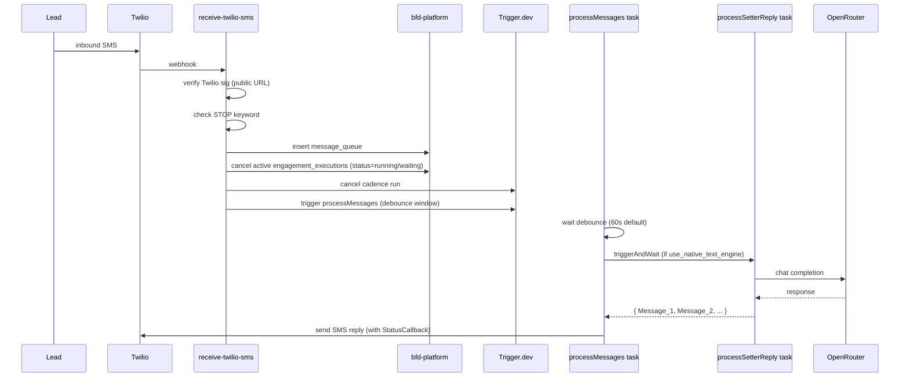
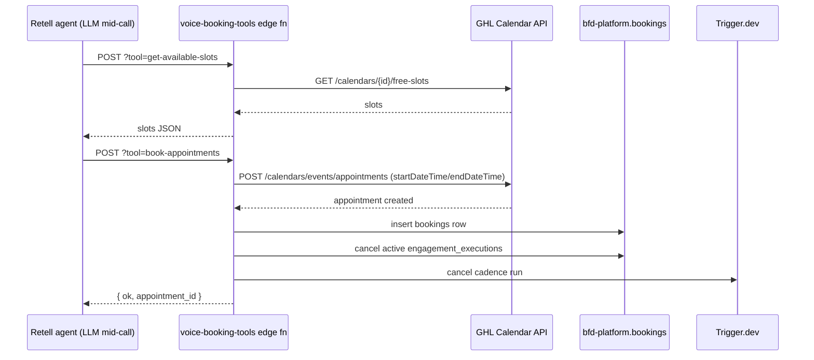
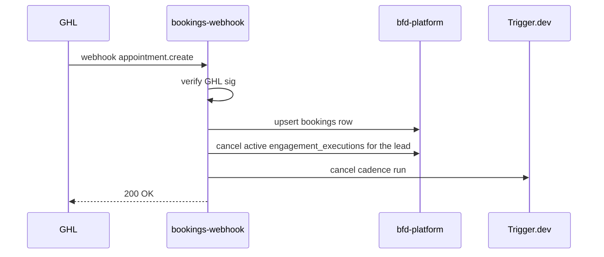

# BFD-setter Architecture

> **Verified against code 2026-07-20** (`Docs/AUDIT_2026-07-20.md`). The component map below is the
> BUILT state, not a target: every box in it exists. Where a detail was found stale it has been
> corrected in place and dated. Counts as of that audit: **97 edge functions** + `_shared/`
> (`frontend/supabase/functions/`), **387 migrations** (`frontend/supabase/migrations/`), **15
> Trigger.dev tasks** (7 of them scheduled).

## Component map (as built)

```
External lead sources
─ FB Instant Forms (GHL native)
─ Website forms / Typeform / Calendly
─ CSV import (process-lead-file)
─ Direct API (intake-lead)
              │
              ▼
   ┌──────────────────────────┐
   │ sync-ghl-contact         │   ← creates/updates lead in bfd-platform.leads
   │ intake-lead              │     dual-writes to client mirror
   │ process-lead-file        │     auto-enrols in cadence if client opted-in
   └──────┬───────────────────┘
          │
          ▼
   ┌──────────────────────────┐
   │ engagement_executions    │   ← runEngagement Trigger.dev task
   │ (cadence state machine)  │     processes engage / delay / phone_call nodes
   └─┬──────┬──────┬──────────┘     respects quiet hours + opt-out
     │      │      │
   SMS    Voice   Voicemail
     │      │      drop
     ▼      ▼      ▼
   Twilio  Retell  Twilio (TwiML <Play>)
     │      │
     └──┬───┘
        │ leads reply / pick up
        ▼
   ┌──────────────────────────┐
   │ receive-twilio-sms       │   ← STOP keyword → opt-out
   │ receive-dm-webhook       │     reply detected → end cadence
   │ retell-call-analysis-    │     human pickup → end cadence
   │   webhook                │     booking made → end cadence + bookings row
   └──────┬───────────────────┘
          │
          ▼
   ┌──────────────────────────┐
   │ processMessages          │   ← AI reply via processSetterReply
   │ (Trigger.dev task)       │     native engine is MANDATORY: processMessages
   └──────────────────────────┘     throws if use_native_text_engine is false
                                    (trigger/processMessages.ts:112-113)

Cross-cutting:
─ push-contact-to-ghl: BFD-setter UI edits → GHL Contacts API
─ voice-booking-tools: Retell tools → GHL Calendar API direct
─ kb-ingest: KB content → bfd-setter-live.documents
─ twilio-status-webhook: SMS delivery callbacks → sms_delivery_events
─ bookings-webhook: GHL appointment webhooks → bookings + cadence-end
```

## Data stores

| Store | Project ref | Tables (key ones) | Used by |
|---|---|---|---|
| bfd-platform | `bjgrgbgykvjrsuwwruoh` | clients, leads, message_queue, engagement_executions, engagement_workflows, dm_executions, error_logs, bookings, cadence_metrics, sms_delivery_events, lead_optouts, voice_call_logs, sms_messages | All edge functions, Trigger.dev tasks, frontend dashboard |
| bfd-setter-live | `qildpilxjodxdifggmto` | leads (mirror), chat_history, text_prompts, voice_prompts, documents | n8n (legacy) + processSetterReply (native) |
| Twilio | (BFD account) | n/a — REST API | SMS in/out, voice trunk, status callbacks |
| Retell | per-client | n/a — REST API | Voice agents (LLM + TTS), webhook events |
| GHL (LeadConnector) | per-client location | n/a — REST API | Contacts, Calendar, FB/IG/WA, custom fields |
| OpenRouter | per-client | n/a — REST API | LLM inference for processSetterReply, sendFollowup, runEngagement (when text generation needed) |
| Trigger.dev | proj_fdozaybvhgxnzopabtse | Trigger console | All long-running tasks |

## Sequence: lead arrives via GHL Instant Form

```mermaid
sequenceDiagram
  participant FB as Facebook Instant Form
  participant GHL
  participant Sync as sync-ghl-contact
  participant Plat as bfd-platform.leads
  participant Mirror as client-mirror.leads
  participant Trigger as Trigger.dev runEngagement
  participant Twilio
  participant Lead as Lead's phone

  FB->>GHL: form submission
  GHL->>Sync: webhook contact.create
  Sync->>Plat: insert leads row
  Sync->>Mirror: upsert mirror leads row
  Sync->>Trigger: trigger run-engagement (if auto_engagement_workflow_id set)
  Trigger->>Trigger: respect quiet hours; check lead_optouts
  Trigger->>Twilio: send SMS (with StatusCallback)
  Twilio->>Lead: SMS delivered
  Twilio-->>twilio-status-webhook: delivery callback
  twilio-status-webhook->>Plat: insert sms_delivery_events
```

## Sequence: lead replies during cadence



## Sequence: voice booking via Retell tool



## Sequence: GHL appointment webhook (booked outside voice flow)



## Deployment topology

- **Frontend dashboard:** Railway service. Customer URL `https://app.buildingflowdigital.com/`. Build deploys via Railway on push to main. There is no Dockerfile and no `railway.json` in the repo: Railway auto-detects the Node build, runs `vite build`, and serves `dist` via `npx serve dist -s` using `frontend/public/serve.json`.
- **n8n (legacy):** the n8n CODE PATH is decommissioned. `processMessages` now throws rather than calling it (`trigger/processMessages.ts:112-113`) and the repo holds no n8n workflow code, only `n8n/exports/Text_Engine_REVERSE_ENGINEERED.md`. Whether the Railway n8n SERVICE is still running is **UNVERIFIABLE FROM REPO**; shutting it down is still an open Brendan item in `Docs/SESSION_PLAN.md`. Two dead n8n URL references survive in code (`elevenlabs-manage-agent`, `voice-booking-tools`).
- **Supabase Edge Functions:** deployed via the bundle-endpoint scripts in `scripts/` (`deploy_single_fn.mjs`, `deploy_with_shared.mjs`), NOT the plain `supabase functions deploy` CLI, which drops `_shared/` imports. Project ref `bjgrgbgykvjrsuwwruoh`. See `SOP/RUNBOOK.md`.
- **Trigger.dev tasks:** deployed via `npx trigger.dev deploy --env prod`. Project `proj_fdozaybvhgxnzopabtse`.
- **Supabase Postgres:** migrations applied via Management API (preferred) or `supabase migration up`.

## Auth model

- **Edge fn → Supabase:** `SUPABASE_SERVICE_ROLE_KEY` (auto-remapped to `sb_secret_*` since 2026-04-29).
- **Frontend → Edge fn:** Supabase Auth JWT in `Authorization: Bearer ...` header. Edge fn decodes locally (see `check-client-subscription/index.ts:60-71`) + checks `user_roles` + `profiles` for ownership.
- **Edge fn → external (Twilio/Retell/GHL/OpenRouter):** per-client API keys stored in `clients` table columns. Read with service role.
- **External → Edge fn (webhooks):** signature verification is IMPLEMENTED for all of Twilio, Stripe, GHL, Retell and Unipile (`_shared/verify-webhook.ts` for Retell/Unipile; per-function HMAC for Twilio and GHL). **The important distinction is fail-closed vs verify-if-present** (verified 2026-07-20):
  - **Fail closed** (reject when the secret is absent): `stripe-webhook` (`index.ts:83-84`), the three Twilio receivers, `receive-dm-webhook` (`auth.ts:9-14`), `intake-lead` (`index.ts:313`), `voice-booking-tools` (`index.ts:143`).
  - **Verify-if-present** (accepted UNVERIFIED while the per-client secret is NULL, therefore forgeable): the 3 Retell receivers, `bookings-webhook`, `sync-ghl-contact`, `ghl-tag-webhook`, `workflow-inbound-webhook`.
  - `retell_webhook_secret` is deliberately NOT auto-generated by `webhook-manifest` (`index.ts:13`); arming it is a first-client gate (`Docs/FIRST_CLIENT_TASKS.md`).
  - The Unipile scheme is a static-token compare whose header/value is **unconfirmed against Unipile's live config** (`_shared/verify-webhook.ts:76-86`); leave `unipile_webhook_secret` NULL until confirmed.

## Repo layout

```
/
├── trigger/                  # Trigger.dev task definitions — 15 tasks (7 scheduled)
│   ├── _shared/              # task helpers + 23 Node unit tests
│   ├── processMessages.ts    # event tasks:
│   ├── processSetterReply.ts #   process-messages, process-setter-reply, run-engagement,
│   ├── runEngagement.ts      #   send-followup, run-ai-job, execute-workflow,
│   ├── sendFollowup.ts       #   place-outbound-call, schedule-callback
│   ├── placeOutboundCall.ts  # scheduled tasks (cron, UTC):
│   ├── runAiJob.ts           #   analyze-sms-conversations, refresh-cadence-funnel,
│   ├── executeWorkflow.ts    #   nudge-cold-reply, poll-retell-drift, synthetic-probe
│   ├── scheduleCallback.ts   #     (all hourly, 0 * * * *)
│   ├── errorDigest.ts        #   error-digest (0 22 * * *)
│   └── weeklyClientReport.ts #   weekly-client-report (0 23 * * 0)
├── frontend/
│   ├── src/                  # React dashboard (React 18, Vite 8, Tailwind, shadcn/ui)
│   │   ├── pages/             # 72 page components; routes declared in App.tsx (88 <Route>)
│   │   └── lib/               # 2 Node unit tests live here
│   ├── supabase/
│   │   ├── functions/         # 97 Deno edge fns (one folder per function) + _shared/
│   │   │   ├── _shared/       # ~26 shared modules: auth, verify-webhook, billing, domain
│   │   │   ├── receive-twilio-sms/
│   │   │   ├── receive-dm-webhook/
│   │   │   ├── retell-proxy/
│   │   │   └── ... (93 more)  # + 35 Deno tests across these dirs
│   │   ├── migrations/        # 387 SQL migrations
│   │   └── config.toml        # verify_jwt per function (32 set false).
│   │                          # NOTE: project_id is still the placeholder
│   │                          # "YOUR_SUPABASE_PROJECT_ID" (config.toml:1)
│   └── package.json
├── supabase/                  # loose schema SQL ONLY — no functions, no migrations
├── scripts/                   # ops scripts + test-harness/ (read .env, never commit secrets)
├── n8n/exports/               # legacy: one reverse-engineering writeup, no live workflows
├── Docs/                      # this directory
├── SOP/                       # operator SOPs + runbook
└── .env                       # gitignored, local secrets
```

---

## Capability set (updated 2026-05-31)

Three capabilities were added/completed in the 2026-05-31 build. All are backward compatible and gated behind deploy (see ROADMAP.md).

### Form-to-agent routing
Different inbound forms for the same client can now activate different agents/cadences. A client may have **many** "new leads" workflows, each bound to a distinct GHL tag (`engagement_workflows.new_leads_tag`); the prior one-per-client cap was relaxed (unique now on `(client_id, new_leads_tag)`).
- Resolver: `frontend/supabase/functions/_shared/resolve-workflow.ts` (tag → workflow, else `clients.auto_engagement_workflow_id` fallback). Unit-tested.
- Wired into `ghl-tag-webhook`, `sync-ghl-contact`, `intake-lead`; `leads.form_source` records the originating tag.
- Managed in the Workflows UI (multiple tag-bound campaigns per client).
- Operator action: each GHL form/workflow must emit its routing tag into the webhook.
- **GHL operator guide (forms, tags, automations, webhooks, verification checklist): see [GHL_SETUP.md](../SOP/GHL_SETUP.md).** Routing internals + voice-agent provisioning: [FORM_ROUTING.md](FORM_ROUTING.md). Try-Gary routes to the cadence tagged `bfd_setter-try_gary` (constant `TRY_GARY_WORKFLOW_TAG`).

### Native reactivation (cold-list calling)
The "DB Reactivation" flow now enrols an uploaded CSV / selected contacts into a chosen cadence **natively** via `runEngagement` — no external/n8n webhook.
- New `reactivate-lead-list` edge fn: verifies the operator once, then per lead upserts the lead + inserts `engagement_executions` + fires `run-engagement` (chunked). Pure helpers in `_shared/reactivate-list.ts` (unit-tested).
- The legacy `campaign_leads` → `campaign-executor` → `campaign_webhook_url` path is **retired (2026-05-31)**: the `campaign-executor` and `bulk-insert-leads` edge functions were deleted, the `campaign_leads` table no longer exists, and `campaigns` is marked deprecated (read only by the legacy campaign Dashboard/CampaignDetail UI).

### Voice setters (UUID model, populated)
The `voice_setters` / `voice_setter_phone_bindings` tables are now real for every client:
- Backfill migration populates them from the legacy slot columns (idempotent; stamps a `legacy_slot` bridge).
- `retell-proxy` dual-writes `voice_setters` on agent create/update.
- The Retell Agents UI exposes all 10 slots.
- The legacy `Voice-Setter-N` slot path remains the live resolution path (zero risk to live calls); a UUID-native cadence picker + per-setter phone-binding UI are the documented follow-ups.

---

## Current wiring notes (verified 2026-06-25)

These supersede any older detail in the diagrams above where they conflict:

- **Inbound voice is a SEPARATE agent.** `+61481614530` inbound is bound to `agent_b2f6495` ("Inbound BFD Agent", neutral greeting); outbound is `agent_f45f4dd` ("Main Outbound", `{{first_name}}` opener). Always read the **phone-number binding** (`list-phone-numbers` `inbound_agent_id`/`outbound_agent_id`) to know which agent serves a direction — never trust a hardwired number on an agent.
- **Outbound SMS is Twilio-direct.** As of 2026-06-17 every outbound message is sent DIRECT via Twilio; GHL is cut out of the send path (GHL is only mirrored). The component map's SMS branch is correct; the multi-channel (WhatsApp/DM) scaffolding is intentionally preserved but un-surfaced. See `Docs/ROADMAP.md` "inbound multi-channel" + memory `project_ghl_is_the_outbound_send_channel`.
- **Voicemail is Retell-native**, not the old Twilio `<Play>` TwiML path (removed in phase-11d). See `Docs/CADENCE_DESIGN.md` → "Voicemail (Retell-native)".
- **Multi-DB.** The frontend reads the platform DB *and* per-client external DBs, so `types.ts` is never wholesale-regenerated (surgical adds only).
- **`clients_public` view.** Browser reads of non-secret `clients` columns go through the `clients_public` view (security_invoker; omits 13 secret columns, exposes `has_<col>` booleans). Secret *values* still read by some browser flows are tracked as `BUG_LIST` G3-6. See memory `project_clients_public_view_b5_s1_1_2026_06_24`.
