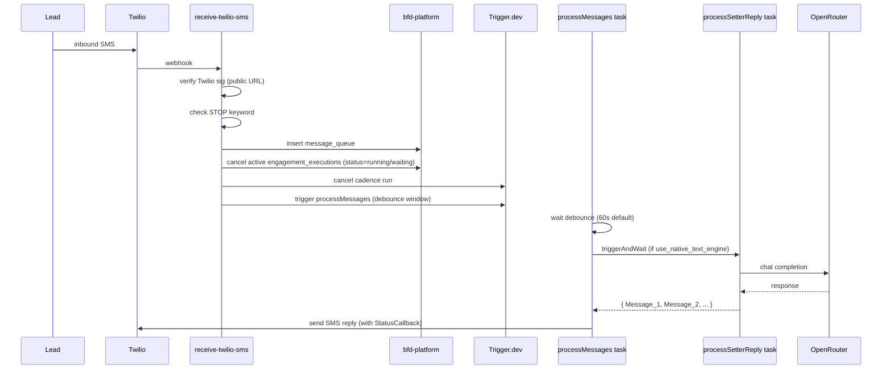
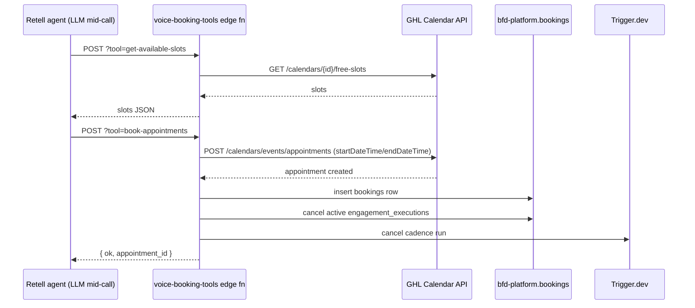
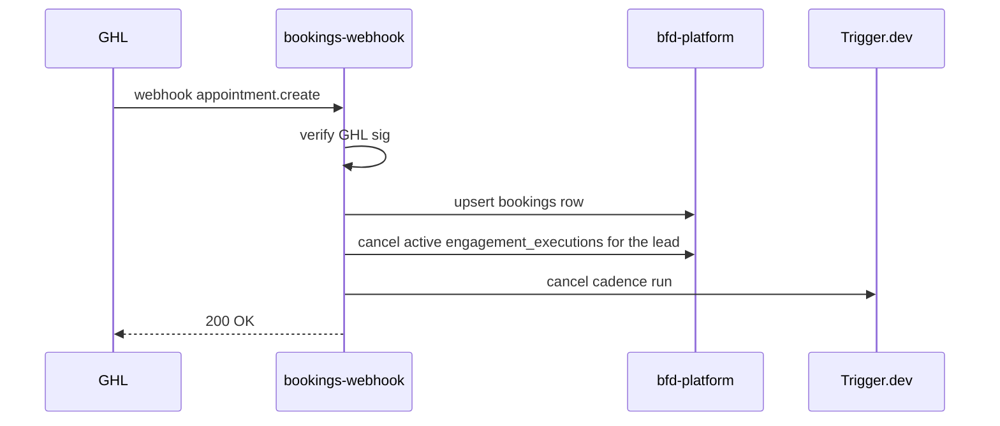

# BFD-setter Architecture

## Component map (target state, end of rebuild)

```
External lead sources
─ FB Instant Forms (GHL native)
─ Website forms / Typeform / Calendly
─ CSV import (process-lead-file)
─ Direct API (intake-lead)
              │
              ▼
   ┌──────────────────────────┐
   │ sync-ghl-contact         │   ← creates/updates lead in bfd-platform.leads
   │ intake-lead              │     dual-writes to client mirror
   │ process-lead-file        │     auto-enrols in cadence if client opted-in
   └──────┬───────────────────┘
          │
          ▼
   ┌──────────────────────────┐
   │ engagement_executions    │   ← runEngagement Trigger.dev task
   │ (cadence state machine)  │     processes engage / delay / phone_call nodes
   └─┬──────┬──────┬──────────┘     respects quiet hours + opt-out
     │      │      │
   SMS    Voice   Voicemail
     │      │      drop
     ▼      ▼      ▼
   Twilio  Retell  Twilio (TwiML <Play>)
     │      │
     └──┬───┘
        │ leads reply / pick up
        ▼
   ┌──────────────────────────┐
   │ receive-twilio-sms       │   ← STOP keyword → opt-out
   │ receive-dm-webhook       │     reply detected → end cadence
   │ retell-call-analysis-    │     human pickup → end cadence
   │   webhook                │     booking made → end cadence + bookings row
   └──────┬───────────────────┘
          │
          ▼
   ┌──────────────────────────┐
   │ processMessages          │   ← AI reply via processSetterReply
   │ (Trigger.dev task)       │     (native, behind use_native_text_engine flag)
   └──────────────────────────┘

Cross-cutting:
─ push-contact-to-ghl: BFD-setter UI edits → GHL Contacts API
─ voice-booking-tools: Retell tools → GHL Calendar API direct
─ kb-ingest: KB content → bfd-setter-live.documents
─ twilio-status-webhook: SMS delivery callbacks → sms_delivery_events
─ bookings-webhook: GHL appointment webhooks → bookings + cadence-end
```

## Data stores

| Store | Project ref | Tables (key ones) | Used by |
|---|---|---|---|
| bfd-platform | `bjgrgbgykvjrsuwwruoh` | clients, leads, message_queue, engagement_executions, engagement_workflows, dm_executions, error_logs, bookings, cadence_metrics, sms_delivery_events, lead_optouts, voice_call_logs, sms_messages | All edge functions, Trigger.dev tasks, frontend dashboard |
| bfd-setter-live | `qildpilxjodxdifggmto` | leads (mirror), chat_history, text_prompts, voice_prompts, documents | n8n (legacy) + processSetterReply (native) |
| Twilio | (BFD account) | n/a — REST API | SMS in/out, voice trunk, status callbacks |
| Retell | per-client | n/a — REST API | Voice agents (LLM + TTS), webhook events |
| GHL (LeadConnector) | per-client location | n/a — REST API | Contacts, Calendar, FB/IG/WA, custom fields |
| OpenRouter | per-client | n/a — REST API | LLM inference for processSetterReply, sendFollowup, runEngagement (when text generation needed) |
| Trigger.dev | proj_fdozaybvhgxnzopabtse | Trigger console | All long-running tasks |

## Sequence: lead arrives via GHL Instant Form

```mermaid
sequenceDiagram
  participant FB as Facebook Instant Form
  participant GHL
  participant Sync as sync-ghl-contact
  participant Plat as bfd-platform.leads
  participant Mirror as client-mirror.leads
  participant Trigger as Trigger.dev runEngagement
  participant Twilio
  participant Lead as Lead's phone

  FB->>GHL: form submission
  GHL->>Sync: webhook contact.create
  Sync->>Plat: insert leads row
  Sync->>Mirror: upsert mirror leads row
  Sync->>Trigger: trigger run-engagement (if auto_engagement_workflow_id set)
  Trigger->>Trigger: respect quiet hours; check lead_optouts
  Trigger->>Twilio: send SMS (with StatusCallback)
  Twilio->>Lead: SMS delivered
  Twilio-->>twilio-status-webhook: delivery callback
  twilio-status-webhook->>Plat: insert sms_delivery_events
```

## Sequence: lead replies during cadence



## Sequence: voice booking via Retell tool



## Sequence: GHL appointment webhook (booked outside voice flow)



## Deployment topology

- **Frontend dashboard:** Railway service. Customer URL `https://app.buildingflowdigital.com/`. Build deploys via Railway on push to main.
- **n8n (legacy):** Railway service. To be decommissioned after Phase 10. Pinned to 2.17.7.
- **Supabase Edge Functions:** auto-deployed via `supabase functions deploy <slug>`. Project ref `bjgrgbgykvjrsuwwruoh`.
- **Trigger.dev tasks:** deployed via `npx trigger.dev deploy --env prod`. Project `proj_fdozaybvhgxnzopabtse`.
- **Supabase Postgres:** migrations applied via Management API (preferred) or `supabase migration up`.

## Auth model

- **Edge fn → Supabase:** `SUPABASE_SERVICE_ROLE_KEY` (auto-remapped to `sb_secret_*` since 2026-04-29).
- **Frontend → Edge fn:** Supabase Auth JWT in `Authorization: Bearer ...` header. Edge fn decodes locally (see `check-client-subscription/index.ts:60-71`) + checks `user_roles` + `profiles` for ownership.
- **Edge fn → external (Twilio/Retell/GHL/OpenRouter):** per-client API keys stored in `clients` table columns. Read with service role.
- **External → Edge fn (webhooks):** signed webhooks (Twilio, Stripe today; GHL/Retell/Unipile pending Phase 8).

## Repo layout

```
/
├── trigger/                  # Trigger.dev task definitions
│   ├── processMessages.ts
│   ├── processSetterReply.ts (Phase 1, NEW)
│   ├── runEngagement.ts
│   ├── sendFollowup.ts
│   └── placeOutboundCall.ts
├── frontend/
│   ├── src/                  # React dashboard (Vite, Tailwind, shadcn/ui)
│   ├── supabase/
│   │   ├── functions/         # Deno edge fns (one folder per function)
│   │   │   ├── _shared/       # (Phase 4b, NEW) — business-hours helper etc
│   │   │   ├── receive-twilio-sms/
│   │   │   ├── receive-dm-webhook/
│   │   │   ├── retell-proxy/
│   │   │   └── ... (50+ more)
│   │   ├── migrations/        # SQL migrations
│   │   └── config.toml        # Function configs (verify_jwt etc)
│   └── package.json
├── scripts/                   # one-off ops scripts (read .env, never commit secrets)
├── n8n/exports/               # (Phase 1-3 prereq, NEW) Brendan exports JSON here
├── Docs/                      # this directory
└── .env                       # gitignored, local secrets
```

---

## Capability set (updated 2026-05-31)

Three capabilities were added/completed in the 2026-05-31 build. All are backward compatible and gated behind deploy (see ROADMAP.md).

### Form-to-agent routing
Different inbound forms for the same client can now activate different agents/cadences. A client may have **many** "new leads" workflows, each bound to a distinct GHL tag (`engagement_workflows.new_leads_tag`); the prior one-per-client cap was relaxed (unique now on `(client_id, new_leads_tag)`).
- Resolver: `frontend/supabase/functions/_shared/resolve-workflow.ts` (tag → workflow, else `clients.auto_engagement_workflow_id` fallback). Unit-tested.
- Wired into `ghl-tag-webhook`, `sync-ghl-contact`, `intake-lead`; `leads.form_source` records the originating tag.
- Managed in the Workflows UI (multiple tag-bound campaigns per client).
- Operator action: each GHL form/workflow must emit its routing tag into the webhook.
- **Operator setup + Try-Gary specifics + voice-agent provisioning: see [FORM_ROUTING.md](FORM_ROUTING.md).** Try-Gary routes to the cadence tagged `bfd_setter-try_gary` (constant `TRY_GARY_WORKFLOW_TAG`).

### Native reactivation (cold-list calling)
The "DB Reactivation" flow now enrols an uploaded CSV / selected contacts into a chosen cadence **natively** via `runEngagement` — no external/n8n webhook.
- New `reactivate-lead-list` edge fn: verifies the operator once, then per lead upserts the lead + inserts `engagement_executions` + fires `run-engagement` (chunked). Pure helpers in `_shared/reactivate-list.ts` (unit-tested).
- The legacy `campaign_leads` → `campaign-executor` → `campaign_webhook_url` path is **retired (2026-05-31)**: the `campaign-executor` and `bulk-insert-leads` edge functions were deleted, the `campaign_leads` table no longer exists, and `campaigns` is marked deprecated (read only by the legacy campaign Dashboard/CampaignDetail UI).

### Voice setters (UUID model, populated)
The `voice_setters` / `voice_setter_phone_bindings` tables are now real for every client:
- Backfill migration populates them from the legacy slot columns (idempotent; stamps a `legacy_slot` bridge).
- `retell-proxy` dual-writes `voice_setters` on agent create/update.
- The Retell Agents UI exposes all 10 slots.
- The legacy `Voice-Setter-N` slot path remains the live resolution path (zero risk to live calls); a UUID-native cadence picker + per-setter phone-binding UI are the documented follow-ups.
