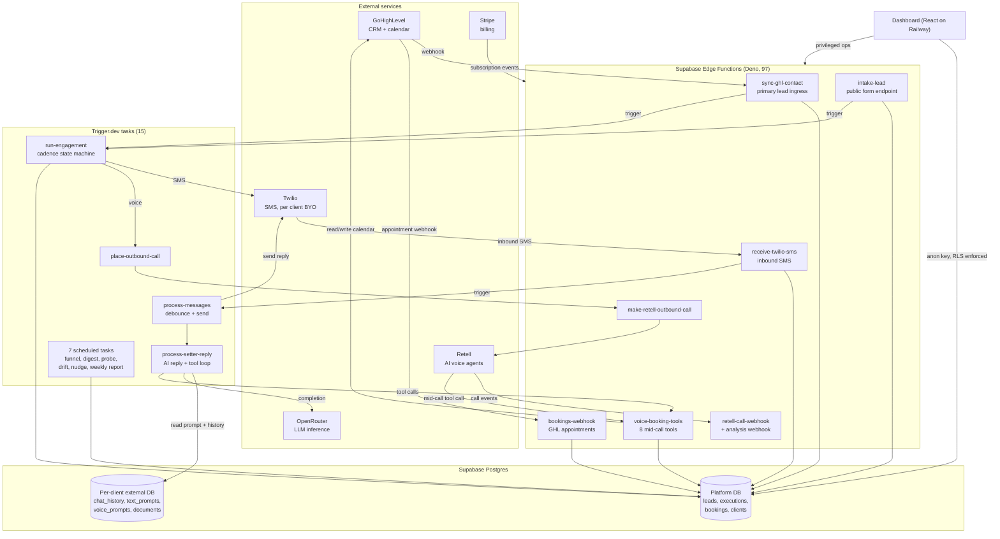
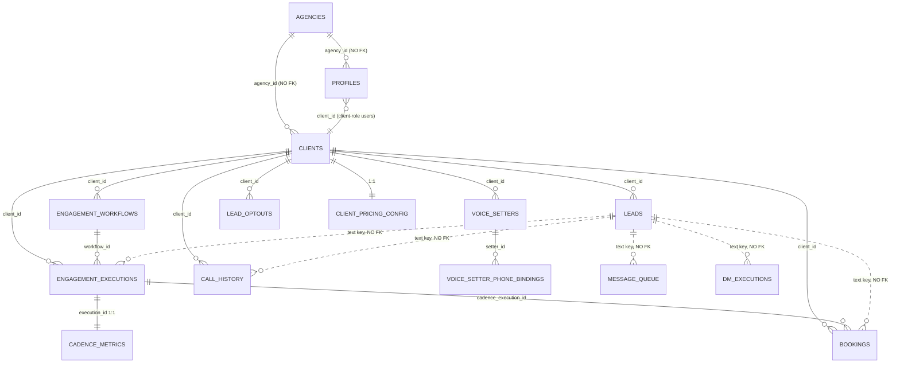

# PROJECT OVERVIEW: bfd-setter

**This is the canonical document for this repository.** If every other document here were lost, this
one should let a competent person rebuild their understanding of the system.

Written 2026-07-20, against commit `0fb9e09` on branch `chore/docs-audit-2026-07-20`. It builds on
[`Docs/AUDIT_2026-07-20.md`](Docs/AUDIT_2026-07-20.md) but every material claim was re-verified against
code. Where the audit and the code disagreed, the code won, and those corrections are called out.

**Reading conventions used throughout:**

- **As-built** claims are stated plainly. **Planned or unbuilt** things always say so in the same sentence.
- Non-obvious claims cite `path/to/file.ts:LINE`.
- **UNVERIFIABLE FROM REPO** means exactly that: it needs a live database, dashboard or phone call to settle.

---

## 1. What this is

BFD-setter is the software behind **Building Flow**, a done-for-you service sold by Building Flow
Digital (BFD) to small businesses that generate leads and then lose them by being slow to respond.

The product is an **AI appointment setter**. A business's leads arrive (usually from a Facebook lead
form or a website form, landing in the business's CRM). Within seconds, the system starts working that
lead: it texts them, and if they do not reply it calls them with an AI voice agent. When the lead
engages, the AI holds a real conversation, handles objections, checks the business's actual calendar
availability, and books an appointment directly into that calendar. The moment the lead replies, books,
or answers the phone, the chase stops automatically. If they text STOP, they are suppressed permanently.

From the outside, end to end:

1. A lead fills in a form. The business's GoHighLevel CRM fires a webhook at BFD-setter.
2. BFD-setter creates a lead record and enrols it into a **cadence**, a configured sequence of touches.
3. The cadence sends an SMS from the client's own phone number. Then it waits. Then perhaps it calls.
4. If the lead texts back, an AI **text setter** replies conversationally, usually within about a minute.
5. If the AI needs times, it reads live calendar availability and offers real slots. When the lead
   accepts, it books the appointment and writes it into the CRM's calendar.
6. Booking ends the cadence. So does a reply, an answered call, or an opt-out.
7. The business watches all of this in a web dashboard, and gets a weekly report.

The person operating this is Brendan, who runs BFD. Clients do not configure anything. The commercial
model is one managed monthly fee covering Retell, Supabase, OpenRouter, the platform, and GoHighLevel
where BFD provides it; the client pays Twilio directly for their own phone number and SMS usage
(`SOP/CLIENT_ONBOARDING_SOP.md:36-40`).

**What it does not do today.** It is **SMS and voice only**. Outbound email and outbound social DM are
not live, and the cadence engine deliberately hard-fails non-SMS outbound. Inbound DM and WhatsApp
plumbing exists but is not a shipped capability. Do not promise email or DM to a client
(`SOP/CLIENT_ONBOARDING_SOP.md:15-17`).

---

## 2. The problem and the thesis

**The problem.** A lead who fills in a form is interested for a short window, often minutes. Small
businesses answer hours or days later, if at all, and they give up after one or two attempts. The lead
is not lost because the business lacks a CRM. It is lost because nobody did the boring, immediate,
repetitive follow-up. Hiring a human setter to do it is expensive, hard to manage, and does not work at
2am on a Sunday.

**The thesis.** The valuable, hard part is not the conversation, it is the **relentless multi-channel
cadence with correct stopping rules**. So the bet is:

1. **Speed and persistence beat sophistication.** Text in seconds, call if no reply, keep going across
   days, and stop instantly on any signal of engagement.
2. **Booking is the only outcome that counts.** Not replies, not sentiment. The AI holds tools that write
   to a real calendar, so a conversation converts to a booked appointment inside the same call or thread.
3. **The stopping rules are the product's integrity.** Chasing someone who already booked, or texting
   someone who said STOP, destroys trust and, in Australia, breaks the law. So opt-out fails closed and
   four independent events terminate a cadence.
4. **Done-for-you, not self-serve.** BFD configures everything. This is why the codebase optimises for
   one operator's control surface rather than customer self-service onboarding.

**Why not the obvious alternatives.**

- **Why not just GoHighLevel workflows?** GHL can drip messages, but it cannot hold a real conversation,
  cannot reason about calendar availability mid-conversation, and cannot run an AI voice call. GHL is
  kept as the CRM and calendar of record and the system integrates with it rather than replacing it.
- **Why not a generic chatbot?** A chatbot waits to be spoken to. The entire value here is outbound
  persistence with correct termination.
- **Why not buy an existing AI setter product?** BFD started from an open-source one and rebuilt most
  of it. See section 3.

---

## 3. Origin and lineage

### Which repo this is

**This is `bfd-setter`**, at `/srv/bfd/Projects/bfd-setter`. It is the **original and the live
production system**. Stack: React frontend on Railway, Supabase (Postgres plus 97 Deno edge functions),
and Trigger.dev for background jobs. Remotes: `origin` is Forgejo on Tailscale, `github` is
`TheBrendonly/BFD-Setter-OS`. 631 commits from 2026-04-16 to 2026-07-13.

### How it came to be

It was **forked from an open-source project on 2026-04-14**, released upstream as "1Prompt AI Setter
Operating System" (`git log` first commit `b45d88e`, 2026-04-16; MIT licence inherited). The fork
arrived with a React dashboard, roughly 70 edge functions, and a set of **n8n workflows** that owned the
LLM orchestration.

The rebuild that followed is documented in the original plan, now archived at
`Docs/archive/MASTER_PLAN.md`. Its problem statement is the clearest single statement of why this
codebase exists in its current form:

> - n8n owns LLM orchestration (single point of failure, opaque JSON workflows, version-pinned to 2.17.7)
> - No automatic lead enrolment in cadences when a lead arrives
> - No tracking funnel
> - No quiet hours / opt-out, sends 24/7, no STOP keyword handling (regulatory risk)
> - No reply-detected cadence-end, the engine keeps texting people who already replied
> - No booking-detected cadence-end
> - No Twilio delivery callbacks, silent SMS failures
> - 3 inbound webhooks have no signature verification

The plan ran as ten phases, ending in Phase 9 (cut over to the native TypeScript text engine) and Phase
10 (delete the n8n call sites). Both completed. `trigger/processMessages.ts:112-113` now **throws** if
`use_native_text_engine` is false, so the native engine is mandatory, not a flag.

The last upstream branding was removed on 2026-07-10 in a deliberate purge (`4f560ef`), which also
deleted roughly 2,000 lines of n8n-era setup wizard and 112 orphaned screenshots. Note that the purge
commit records a decision people misread: **Brendan keeps his own separate n8n service for other,
non-bfd-setter work.** It was never a bfd-setter dependency to switch off (`Docs/BRENDAN_TODO.md:148`).

### The sibling: `bfd-setter-v2`

`/srv/bfd/Projects/bfd-setter-v2` is a **separate, from-scratch rebuild of the same product**, not a
branch or a refactor of this one. It began 2026-07-14, one day after the kickoff prompt in
[`Docs/REBUILD_PRD_KICKOFF.md`](Docs/REBUILD_PRD_KICKOFF.md) was committed here.

The method was: have a model reverse-engineer this live system into an exhaustive PRD, hard-separating
(A) the immutable functional contract, (B) a proposed better architecture including the hosting
decision, and (C) UI improvements, so that "improvements" could never silently change behaviour. Then
build a fresh implementation from that PRD.

Its shape differs sharply from this repo: a pnpm/turbo monorepo with `apps/api`, `apps/web`,
`apps/worker`, its own `db/migrations` with a `migrate.ts` runner, `Dockerfile.api` / `Dockerfile.web` /
`Dockerfile.worker`, and an `ops/` tree containing `backup`, `heartbeat`, `probe`, `smoke` and `ci`.
That is the point: **v2 exists to remove the Supabase and Trigger.dev dependencies in favour of a
self-hostable stack**, and to fix operational gaps this repo has (notably backups, which this repo has
no story for at all, see section 10).

**The honest framing:** this repo is the one with paying-client-ready behaviour, three months of
hard-won production fixes, and 453 passing tests. v2 is younger, cleaner, and unproven. The existence
of v2 is itself a finding about this repo: it was easier to reverse-engineer this system into a PRD than
to read its documentation, which is the strongest possible argument for the document you are reading now.

---

## 4. Architecture

### The four processes

There is no monolith. Four independently deployed things, with no shared runtime:

| Component | Runs on | Responsible for | Lives in |
|---|---|---|---|
| **Dashboard (frontend)** | Railway, static build served by `serve` | All operator and client UI: 72 pages, 88 routes. Talks to Postgres directly via the Supabase anon key, and to edge functions for privileged work. | `frontend/src/` |
| **Edge functions** | Supabase (Deno) | 97 HTTP endpoints: every inbound webhook, every privileged read/write, every third-party API call that needs a secret. | `frontend/supabase/functions/` |
| **Background tasks** | Trigger.dev cloud | 15 tasks. The cadence state machine, the AI reply generation, all scheduled jobs. Owns anything that must survive minutes to days. | `trigger/` |
| **Database** | Supabase Postgres | 92 tables, 1 view (`clients_public`) as declared in `types.ts`. The tenant boundary is enforced here, in RLS. | `frontend/supabase/migrations/` |

**The critical repo-layout trap:** edge functions and migrations live under **`frontend/supabase/`**.
The root `supabase/` directory holds only three loose `.sql` files, no functions and no migrations. This
catches every newcomer and every fresh AI session.

### Why the split is where it is

The dividing line between an edge function and a Trigger.dev task is **duration**. Edge functions are
request/response and must answer a webhook fast. Anything that waits, including the debounce before an
AI reply and the multi-day gaps in a cadence, is a Trigger.dev task, because
`wait.until()` freezes the run at zero compute cost (`trigger/runEngagement.ts:206-208`).

### Diagram



### Component detail

**Dashboard** (`frontend/src/`). React 18.3, Vite 8.1, Tailwind, shadcn/ui over Radix. Entry
`frontend/index.html` → `src/main.tsx` → `src/App.tsx`, which declares 88 `<Route>` elements. Authorization
is layered guard components: `ProtectedRoute`, `AgencyRoute`, `ClientRouteGuard`, `CreatorRouteGuard`.
State via TanStack Query; the cadence editor canvas uses `@xyflow/react`. It reads the database directly
with the anon key, which is why RLS is the real security boundary, not the UI.

**Edge functions** (`frontend/supabase/functions/`). One directory per function, each its own endpoint
at `{SUPABASE_URL}/functions/v1/<name>`. There is no router. Authorization is centralised in two shared
helpers: `_shared/authorize-client-request.ts` (48 functions, accepts either the service-role key for
server-to-server calls or a validated end-user JWT) and `_shared/assert-client-access.ts` (18 functions).
`_shared/` holds roughly 26 modules covering auth, webhook verification, billing, and domain logic.

**Trigger.dev tasks** (`trigger/`). 8 event-triggered and 7 scheduled. `trigger.config.ts` sets project
`proj_fdozaybvhgxnzopabtse`, `maxDuration: 3600`, 3 retry attempts with exponential backoff. Note tasks
use `process.env`, not `Deno.env`, and their environment is scoped **separately** from Supabase's.

**Scheduled tasks, verified from source:**

| Task | Cron (UTC) | File |
|---|---|---|
| `analyze-sms-conversations` | `0 * * * *` | `trigger/analyzeSmsConversations.ts:11-15` |
| `refresh-cadence-funnel` | `0 * * * *` | `trigger/refreshCadenceFunnel.ts:22-27` |
| `nudge-cold-reply` | `0 * * * *` | `trigger/nudgeColdReply.ts:59-66` |
| `poll-retell-drift` | `0 * * * *` | `trigger/pollRetellDrift.ts:52-55` |
| `synthetic-probe` | `0 * * * *` | `trigger/syntheticProbe.ts:48-52` |
| `error-digest` | `0 22 * * *` | `trigger/errorDigest.ts:40-43` |
| `weekly-client-report` | `0 23 * * 0` | `trigger/weeklyClientReport.ts:39-42` |

`trigger/errorDigest.ts:11-13` warns that declarative crons may not auto-register on deploy. This has
already bitten once: the hourly crons were silently unregistered in production until the 2026-07-12
deploy. **Re-check schedule registration after every Trigger.dev deploy.**

---

## 5. Data model

Derived from `frontend/supabase/migrations/` (387 files) and
`frontend/src/integrations/supabase/types.ts` (**92** tables and 1 view as declared; counted directly,
because two independent automated passes reported 88 and 89 and both were wrong).

### Read this before trusting any of it

**The migrations folder is not the live schema, and neither is `types.ts`.**

- **There is no `schema_migrations` table.** Migrations are applied by hand through the Supabase
  Management API SQL runner. Nothing enforces that a file here ever ran.
- **Some tables have no `CREATE TABLE` anywhere in version control.** `dm_executions`, `message_queue`,
  `active_trigger_runs` and others were installed from a snapshot of the predecessor project and only
  ever appear in `ALTER` statements. `frontend/supabase/migrations/20260422120000_bfd_platform_surgical_patch.sql:2-14`
  lists them as pre-existing.
- **Changes have been made out-of-band and retro-recorded.**
  `20260615120000_reconcile_engagement_executions.sql:4-11` says so explicitly for
  `engagement_executions.active_call_id`: "was added to the live platform DB out-of-band and never
  recorded in a migration... This migration records the column so the history is honest."
- **Conversely, migrations exist that never ran.** See the two traps below.

**Practical rule: treat live `information_schema` as truth, the edge-function code as the best available
proxy for it, `types.ts` as a second opinion, and the migrations folder as narrative commentary.**

### Core entities

| Entity | Purpose | Key columns | Created / materially changed |
|---|---|---|---|
| `agencies` | Top-level tenant container | `id`, `name`, `email UNIQUE` | `20250817105334:2` |
| `clients` | **The tenant of record.** Also a ~160-column config god-object | `id`, `agency_id` (no FK), 13 secret columns, ~30 webhook URLs, ~20 GHL field-id maps, feature flags, cost ceilings, Stripe state | `20250817105334:11`, re-declared `20260303121416:48` |
| `profiles` | Joins `auth.users` to tenancy | `id` → `auth.users`, `agency_id`, `client_id` | `20260303121416:5` |
| `user_roles` | Roles, deliberately a separate table | `user_id`, `role app_role` (`agency`\|`client`), `UNIQUE(user_id,role)` | `20260317080921:3-11` |
| `leads` | Canonical lead | `client_id`, `lead_id text` (**the GHL contact id**), `phone`, `normalized_phone`, `setter_stopped`, timing columns | renamed from `contacts` in `20260403200057:46-47` |
| `engagement_workflows` | The cadence definition | `client_id`, `nodes jsonb` (whole canvas in one blob), `is_active`, `new_leads_tag` | `20260409222644:3-10` |
| `engagement_executions` | **One lead through one cadence. The workhorse.** | `client_id`, `workflow_id`, `ghl_contact_id`, `status`, `current_node_index`, `last_completed_node_index`, `stop_reason`, `trigger_run_id`, `active_call_id` | `20260409222644:47-70` |
| `cadence_metrics` | Denormalised 1:1 rollup per execution | `execution_id UNIQUE`, counters, `cost_estimate_cents` | `20260430120000:41-62` |
| `bookings` | Appointment ledger | `client_id`, `lead_id text`, `ghl_appointment_id`, `appointment_time`, `source`, `UNIQUE(client_id, ghl_appointment_id)` | **two conflicting definitions, see below** |
| `call_history` | Retell post-call record | `call_id UNIQUE`, transcript, sentiment, cost, `appointment_booked` | `20260411182645:2-38` |
| `lead_optouts` | STOP suppression list | `client_id`, `phone`, `UNIQUE(client_id, phone)` | `20260430120000:11-22` |
| `message_queue` | Inbound debounce buffer | `lead_id`, `message_body`, `channel`, `processed` | no `CREATE TABLE` in repo |
| `dm_executions` | Text-setter conversation run | `lead_id`, `setter_messages jsonb`, `status`, `resume_at` | no `CREATE TABLE` in repo |
| `voice_setters` | **First-class voice agent (UUID model)** | `client_id`, `retell_agent_id`, `is_active`, `is_inbound`, `is_retell_locked`, `legacy_slot` | `20260527090000:6-16` |
| `voice_setter_phone_bindings` | Number → setter, per direction | `phone_e164`, `direction`, `setter_id`, `UNIQUE(client_id, phone_e164, direction)` | `20260527090000:22-30` |
| `sms_delivery_events` | Twilio delivery receipts | `twilio_message_sid`, `status`, `error_code` | `20260430120000:25-38` |
| `execution_cost_events` | **Real per-execution cost ledger** | `cost_kind`, `provider_ref`, `UNIQUE(cost_kind, provider_ref)` | `20260707130000:39` |
| `client_pricing_config` | Agency-only cost-to-price inputs | `client_id UNIQUE`, `config jsonb` | `20260701140000:20-28` |

### ER diagram (core entities)



Dotted lines are joins with **no referential integrity**.

### The load-bearing non-FK join

**The product's real join key is the GoHighLevel contact id, carried as an untyped `text` column, with
no foreign key anywhere.** `leads.lead_id`, `engagement_executions.ghl_contact_id`,
`cadence_metrics.lead_id`, `bookings.lead_id`, `message_queue.lead_id`, `dm_executions.lead_id` and
`call_history.contact_id` are all that same string. `leads.id` (a real uuid) is used for almost nothing.
Inbound SMS resolves phone → contact id by querying `leads.normalized_phone`
(`receive-twilio-sms/index.ts:553`).

This is the single most consequential design fact in the schema. It means the CRM, not the database, is
the identity authority, and it means an orphaned row is always possible.

### Trap 1: `engagement_executions.lead_id` does not exist

Migration `20260412191418:5` renames `ghl_contact_id` → `lead_id`, and `types.ts:2183+` declares
`lead_id: string`. **That rename was never applied to the live database.** The code says so in two
independent places:

- `trigger-engagement/index.ts:130-137`: "engagement_executions keys the contact on `ghl_contact_id` on
  this platform DB (the ghl_contact_id→lead_id rename migration was never applied)".
- `receive-twilio-sms/index.ts:94-98`: `ghl_contact_id` is "the canonical column on
  engagement_executions; receive-dm-webhook used to query a non-existent `lead_id` column, silently
  broken."

The same migration renamed the column on four other tables where it *did* apply. So the rename is
**partially applied**, which is worse than either extreme.

### Trap 2: `bookings` has two competing schemas

Two `CREATE TABLE public.bookings` statements exist:

1. `20260415115453:3-23`: `lead_id uuid REFERENCES leads(id)`, `start_time`/`end_time`, `title`,
   `location`, `setter_name`, `cancellation_link`, `campaign_id`. Its `ghl_appointment_id` was then
   renamed to `ghl_booking_id` by `20260415120718:1`.
2. `20260430120000:70-86`: `lead_id text`, `ghl_appointment_id`, `appointment_time`/`appointment_end_time`,
   `source`, `UNIQUE(client_id, ghl_appointment_id)`. Uses `CREATE TABLE IF NOT EXISTS`, so it would
   **silently no-op** on a database where (1) had already run.

**The write path uses shape 2** exclusively: `voice-booking-tools/index.ts:695-705` upserts
`ghl_appointment_id` / `appointment_time` `onConflict: "client_id,ghl_appointment_id"`.
**`types.ts` declares shape 1.** **A frontend read uses shape 1**: `ContactDetail.tsx:189` selects
`start_time, ghl_booking_id, campaign_id, title, location, cancellation_link, setter_name, setter_type`.
Meanwhile `Logs.tsx:394` configures an `appointment_time` column, so a single file spans both shapes.

**What is actually live is UNVERIFIABLE FROM REPO,** but the strong inference is that the live table
carries the **union** of both column sets, added out-of-band:

- A live SMS booking passed end to end on 2026-07-13 with a confirmed `bookings` row, so shape 2's
  columns must exist.
- `ContactDetail.tsx` is not reported broken, and a Supabase select naming a non-existent column errors
  rather than returning empty, so shape 1's columns probably exist too.
- `20260706130000_f15a_booking_status_events.sql:3` calls the live table "phase7a shape", supporting
  shape 2 as canonical.

**One query settles it and should be run before anyone touches booking code:**
`SELECT column_name FROM information_schema.columns WHERE table_name = 'bookings' ORDER BY 1;`

### Multi-tenancy, and "the trap"

Two nested levels: **agency** (`agencies.id`) and **client/sub-account** (`clients.id`). Nearly every
table carries `client_id` and is scoped by joining out to `clients.agency_id`.

Role resolution uses two `SECURITY DEFINER` helpers so they can be called inside policies without
recursion: `get_user_role(uuid)` reads `user_roles`, and `get_user_client_id(uuid)` reads
`profiles.client_id`. `get_user_role` was originally nondeterministic for a user holding both roles and
was hardened to prefer the more privileged role (`20260708120000:11-23`).

**The trap, and it is the most important security fact in this system:** a client-role user's
`profiles.agency_id` is set to the **same** agency id as their client's `clients.agency_id`. So every
policy written as "agency-scoped" (`agency_id` match, `FOR ALL`) was **also matched by a client-role
JWT**, for its own row *and every sibling client in the same agency*. First written down at
`20260701140000_client_pricing_config.sql:6-19`, restated with full blast radius at
`20260713120000_gate_a_rls_role_gate.sql:3-11`: a client-role user would have gained read/write on
`supabase_service_key` (a full service-role key), Twilio tokens, BFD's bundled Retell/OpenRouter/GHL
keys, sibling leads, prompts, and margin data.

It was latent only because **zero client-role users have ever existed**.

**GATE A** (2026-07-13) closed it in three migrations:

1. `20260713120000_gate_a_rls_role_gate.sql` replaces `FOR ALL` on `clients` with four
   command-specific policies each requiring `get_user_role() = 'agency'`, plus a narrow
   `client_own_clients_update` because ~36 browser paths write UI state onto `clients`. A
   `BEFORE UPDATE` guard trigger (`:105-131`) raises `insufficient_privilege` if a client-role writer
   touches `subscription_status`, `retell_api_key`, `openrouter_api_key`, `openrouter_management_key` or
   `ghl_api_key`, preventing billing-gate self-escalation. Service-role writes have `auth.uid() IS NULL`
   so the trigger is inert for them.
2. `20260713130000_gate_a_clients_public_definer.sql`: the `clients_public` view projects **111
   non-secret columns** and replaces each of the **13 secrets** with a `has_<col>` boolean
   (`:116-128`), so the UI can render "configured / not configured" without the value leaving the
   database. The view was flipped from `security_invoker` to **`security_definer`**, with tenancy moved
   into its own `WHERE`: service_role sees all, agency sees its agency, client sees only its own row.
3. `20260713140000_gate_a_clients_client_select_revoke.sql`: a Postgres subtlety forced this: an
   `UPDATE ... WHERE id = own` must *locate* the row via a SELECT policy, so without one the client's own
   UI-state saves **silently no-op'd** (proven with a throwaway probe, `:4-7`). Adds a client own-row
   SELECT policy, then `REVOKE SELECT ON clients FROM authenticated` and re-`GRANT` only the 111
   non-secret columns, so **neither a client nor an agency user can read a secret from base `clients`**.

Verified 24/24 with throwaway agency-role and client-role probes across two sibling clients.

### The multi-database design

The system talks to **two** Postgres databases:

- **Platform DB** (`bjgrgbgykvjrsuwwruoh`), shared: everything transactional.
- **A per-client external Supabase project**, one per tenant, holding `chat_history`, `text_prompts`,
  `voice_prompts`, `documents` (pgvector knowledge base), and a `leads` mirror.

Credentials are four columns on `clients`: `supabase_url`, `supabase_service_key`, `supabase_table_name`,
`supabase_access_token`.

**This is live and load-bearing, not legacy.** `trigger/processSetterReply.ts:199-206` reads the text
setter's system prompt from external `text_prompts` and its conversation memory from external
`chat_history` **before generating any reply**. If the external DB is missing, the setter runs with an
empty prompt and no memory.

Honest caveats:
- **There is no shared helper.** The pattern `if (client.supabase_url && client.supabase_service_key)
  { createClient(...) }` is copy-pasted at roughly 15 call sites.
- **Writes are non-fatal, reads degrade silently.** `intake-lead:459` logs "mirror write failed
  (non-fatal)". `retell-call-webhook:374-378` returns `{ ok: true, skipped: true, reason:
  "no_external_db" }`, so voice call history is silently lost.
- **Provisioning is fully manual.** The external schema is a hand-run SQL seed in a markdown SOP
  (`SOP/CLIENT_ONBOARDING_SOP.md:148-210`). `scripts/onboard-client.mjs:484` only *prints* an
  instruction to do it. This is repeatedly named the number one onboarding blocker.
- **Code and process disagree on how required it is.** `frontend/src/lib/clientReadiness.ts:44-45` tiers
  the external DB as "recommended" (amber), while `SOP/CLIENT_ONBOARDING_SOP.md:633` says creating a
  setter requires it first.

### Other oddities worth knowing

- **Legacy voice slots coexist with the UUID model.** `clients` still has `retell_agent_id_4..10`,
  `retell_inbound_agent_id`, `retell_phone_1/2/3`. `20260527090000:3` says the cleanup migration is
  deferred to "Phase 7"; **it was never written**. `retell-proxy/index.ts:177-186` holds the bridging map,
  and **slots 2 and 3 are deliberately absent** (retired 2026-06-17), so the numbering has a hole. Slot 1
  is shared between the inbound agent and any setter landing there, a known collision class.
- **`types.ts` drift is silent by construction.** Missing entirely: `lead_optouts`,
  `sms_delivery_events`, `client_cost_rollup` (a view; the `Views` block contains only `clients_public`).
  Missing columns: `leads.normalized_phone`, `leads.timezone`. Wrong shape: `bookings`,
  `engagement_executions`. It is never caught because edge functions use an untyped Deno client and the
  browser's only real typecheck is not run in CI (section 9).
- **Two disagreeing cost systems.** `cadence_metrics.cost_estimate_cents` uses hardcoded weights (SMS
  1.4c, email 0.5c, voice 50c, `runEngagement.ts:532-537`), while the tenant ceiling reads
  `client_cost_rollup`, built on real provider figures in `execution_cost_events`
  (`runEngagement.ts:620-624`). They will disagree, and both are consulted.
- **`sms_messages.contact_id` FKs to `demo_page_contacts`, not `leads`**, a fossil of the demo-page
  origin, never repointed.
- **Rename fossils.** `contacts → leads` and the old `leads → campaign_leads` happened in the *same*
  migration (`20260403200057:2,46`). The trigger function is still `trigger_workflow_on_contact_change()`
  and FK names still read `contacts_client_id_fkey`. "Contact", "lead" and "campaign lead" mean different
  things depending on which layer you read.

---

## 6. How it functions end to end

Five flows, traced through real files, with failure modes.

### 6.1 A lead arrives

**Primary ingress: `sync-ghl-contact`.**

| Step | Where |
|---|---|
| Entry, body parsed from JSON / urlencoded / multipart | `sync-ghl-contact/index.ts:220`, parser `:86-111` |
| Extract location id from ~9 aliases, contact id from 3 | `:246-258` |
| **Tenant resolution:** `clients WHERE ghl_location_id = <account id>` | `:328-332` |
| Optional auth: static `x-wh-token` or HMAC, only if `ghl_webhook_secret` is set | `:352-363` |
| Dedup lookup, key `(client_id, lead_id)` | `:378-383` |
| Echo-loop guard (our own `last_synced_from` stamp, `updated_at` < 60s) | `:394-427` |
| Insert via `buildLeadInsert`, which stamps `normalized_phone` | `:521-535`, `_shared/lead-insert.ts:29` |
| **Routing:** tag → workflow, else `clients.auto_engagement_workflow_id` | `_shared/resolve-workflow.ts:58-71` |
| Enrol: insert `engagement_executions` (pending), POST Trigger.dev, stamp `trigger_run_id` | `:125-214` |

Other ingresses: `intake-lead` (public form, bearer `intake_lead_secret`), `ghl-tag-webhook` (tag-only),
`process-lead-file` (CSV, no enrolment), `reactivate-lead-list` (cold list, workflow supplied in body).

**Failure modes.**

| Failure | Handling |
|---|---|
| No client matches the location id | 400, and **no log row** (`logExecution` early-returns on null clientId, `:300`). Silent to the operator. |
| Bad signature | 403 + console warn only. No `error_logs` row. |
| Lead insert fails | 500 + a `sync_ghl_executions` row marked failed (`:537-544`). Note: not `error_logs`. |
| **Enrolment fails** (workflow missing, Trigger.dev non-2xx, missing key) | **Swallowed** (`:594-599`). HTTP 200 `status:"created"` is still returned. |

**Where this flow stops when it breaks:** at an `engagement_executions` row stuck at `status:"pending"`
with `trigger_run_id = NULL`. **The lead exists, no cadence ever runs, and nothing retries or alerts.**
A reconcile migration exists (`20260615120000_reconcile_engagement_executions.sql`) but nothing in
`trigger/` invokes it. This is the quietest failure in the system.

### 6.2 The cadence advances

`trigger/runEngagement.ts`, task `run-engagement`, `maxDuration: 3600`, 2 retry attempts.

**It is not a graph.** It is a linear `for` loop over `workflow.nodes`, a JSONB array
(`runEngagement.ts:856`). No branching, no conditions, no edges. The visual canvas in the UI is a
sequence editor, not a flowchart engine.

Node types: `drip`, `delay`, `engage` (groups channels), `wait_for_reply`, plus legacy flat
`send_sms` / `send_whatsapp` / `phone_call`. Channels within `engage` are `sms | whatsapp | phone_call |
email` (`:33`).

**Two different persistence mechanisms, easily confused:**
- `wait.until({ date })` freezes the Trigger.dev run at zero compute for the multi-day gaps.
- `engagement_executions.last_completed_node_index`, written after every node (`:1678`), is the
  **retry-safety** mechanism: a task retry restarts `run()` from the top and skips completed nodes
  (`:858-860`). Second-order protection comes from `getSentChannelCounts` reading `campaign_events`
  to skip channels already sent in a prior attempt (`:370-395`, applied `:994-1009`).

**Guards before every send:** execution status recheck, `leads.setter_stopped`, and
`isPhoneOptedOut` (`:257-317`). `trigger/_shared/optout.ts:1-16` **fails closed**: a query error returns
"opted out", explicitly to avoid an Australian Spam Act breach. A final guard sits at the Twilio call
itself (`_shared/sendTwilioSmsAndStamp.ts:88`).

**Quiet hours** resolve `workflow.quiet_hours_override` → `clients.cadence_quiet_hours` → default
(`:733-742`), with lead timezone inferred from phone prefix (`:755`). One deliberate exception: on node 0
of a new-leads campaign, the confirmation SMS bypasses the gate (`:957-961`).

**What ends a cadence early**, via `stop_reason`: `sequence_complete`, `inbound_reply`, `call_engaged`,
`setter_stopped` (written here), plus `booking_created` (written by `voice-booking-tools/index.ts:526`)
and `opt_out` (written by `receive-twilio-sms/index.ts:124-136`).

**Failure modes.** Any unhandled throw sets `status:"failed"` and **rethrows**, so Trigger.dev retries
the whole task; resume safety comes from the node index. Post-send writes are deliberately non-fatal
("REL-04", `:1298-1300`) because the money was already spent and a replay would double-send. A cost
ceiling breach writes an `error_logs` row but **does not stop the run** (`:587-604`, `:638-663`).

**There is no dead-letter queue.** After 2 attempts an execution sits at `status:"failed"` forever and
nothing re-drives it.

### 6.3 Inbound SMS becomes an AI reply

**`receive-twilio-sms`** resolves the client by exact string match on `clients.retell_phone_1 = To`
(`:459-465`), then verifies the Twilio HMAC against a **reconstructed public URL**, because Deno reports
an internal `req.url` (`:475-501`).

STOP is handled before anything else (`:519-670`): idempotency via `processed_webhook_sids`,
`lead_optouts` insert, `setter_stopped` on both normalized and raw phone matches, cadence cancellation,
a one-time compliance reply, and a GHL mirror. START is symmetric.

Normal path: resolve the debounce window → insert `message_queue` → upsert `leads` → check for an active
voice call → cancel active cadences with `inbound_reply` → create/reuse `dm_executions` → fire
`process-messages`.

**Debounce precedence** (`:860-878`): `agent_settings.response_delay_seconds` for `(client_id,
"Setter-1")` → `clients.debounce_seconds` → hard default **60s**. `processMessages.ts:156` carries its
own `?? 30` fallback but it is unreachable from this path because the edge function always passes a
value. If a second message arrives inside the window, the existing execution is reused and the original
`resume_at` is preserved (`:1013-1040`).

**`process-messages`** waits out the debounce, then holds while a voice call is active (polling every
20s, 15-minute ceiling, `:175-196`), rechecks opt-out, joins the queued messages, and calls
`process-setter-reply`. It **rechecks opt-out again after generation** (`:337-359`) before sending.

**`process-setter-reply`** builds the prompt from the **external** database: `text_prompts.system_prompt`
plus `chat_history` (`:198-213`). Lead context is deliberately limited to the first name; phone and email
are withheld from the LLM (`:236-239`). Two blocks are injected into the first message: prefetched real
calendar availability, and a **time anchor** giving the model the actual current time
(`:363-378`) to neutralise stale `{{ $now }}` tokens left in stored prompts.

The **tool loop** (`_shared/setterToolLoop.ts:104-189`) allows up to 4 iterations, exposes 6 tools, and
**injects identity last so it always overrides model-supplied values** (`:160`). Tool errors never
throw; they are folded back as tool-role turns. On hitting the cap it forces a `tool_choice:"none"`
wrap-up. Two server-authoritative validators then run: booking arguments are checked against a canonical
slot map, and an off-list datetime is refused with real alternatives (`processSetterReply.ts:385-413`).
Finally three **honesty guards** (`:450-474`) rewrite any reply that claims a booking, reschedule or
cancellation which no successful tool call supports.

Sending is claim-guarded: `claimSend` inserts into `outbound_send_claims`, and a duplicate key means
"already sent, skip". It **fails open** on any other error (`_shared/sendClaim.ts:14-16`), deliberately,
because dedup is a guard and must never become the reason a reply is dropped.

**Failure modes.** An unresolvable `To` number drops the SMS silently with no `error_logs` row. A failed
Twilio send releases the claim, writes `error_logs`, and **continues to the next message bubble**, so
the run still reports success. Final failure marks `dm_executions.status = "failed"` with `has_error`
set **only on the last attempt**. There is no replay.

### 6.4 The voice setter calls and books

`runEngagement` → `place-outbound-call` (dedicated queue, concurrency 20) → `make-retell-outbound-call`.

**Idempotency is taken seriously here because a duplicate is a real phone call to a real person.** Three
layers: a Trigger.dev `idempotencyKey` so a parent retry re-attaches rather than spawning a sibling
(`runEngagement.ts:1092`); a payload `idempotency_key` consumed by the edge function; and a
`call_history (client_id, idempotency_key)` guard that **fails closed** if it cannot read
(`make-retell-outbound-call/index.ts:503-538`). A duplicate insert is logged as
`🚨 DOUBLE-DIAL detected` with an `error_logs` row (`:1021-1038`). Retry classification is equally
careful: a 4xx that is not 429 becomes `AbortTaskRunError`, because retrying re-bills a paid endpoint
(`placeOutboundCall.ts:68-84`).

**Agent selection** reads `voice_setters` by UUID and takes `retell_agent_id` (`:601`), rejecting
inactive or unprovisioned setters. The from-number comes from `voice_setter_phone_bindings` where
`direction='outbound'`. A legacy slot path still exists behind it.

**Mid-call**, Retell calls `voice-booking-tools`, one edge function dispatching on `?tool=` with **eight**
cases (`:1281-1312`); the SMS setter is exposed a six-tool subset, and `lookup-contact` / `send-sms` are
voice-only. Auth **fails closed**: a client with no `intake_lead_secret` gets 401 (`:141-143`).

Booking (`:593-718`) resolves the requested time against live GHL free-slots, re-checks for an existing
appointment at that instant before creating (`:627-631`), creates, and on failure retries exactly once.
If it still fails it **texts the lead a self-serve booking link** rather than leaving them stranded
(`:680`). Then it upserts `bookings` and ends the cadence with `booking_created`. Critically, the
cadence-end call is **hoisted outside the appointment-id parse** (`:715`) so a 200 with an unparseable
body still stops the chase.

**Failure modes.** A booking that succeeds in GHL but fails to write the `bookings` row is **swallowed**
(`:707-709`): the appointment exists but is invisible to every BFD report. A failed `endCadenceOnBooking`
is likewise swallowed (`:539-541`), meaning **a booked lead keeps getting nudged**. If the call outcome
never arrives within 600s the cadence treats it as missed and advances (`runEngagement.ts:1141-1145`).
`retell-call-webhook` is the one place that deliberately returns HTTP 500 to force a provider retry, when
the cadence-critical outcome write fails (`:339-364`).

### 6.5 Reporting

**Live-computed:** `get-show-rate-funnel` recomputes from raw `bookings` on every call, filtering to
setter-sourced bookings so human calendar bookings do not inflate the AI's numbers (`:156-161`), and
using a dual window (booked by `created_at`, held by `appointment_time`, `:163-179`).
`get-client-usage` computes live from `call_history` and `message_queue`.

**Scheduled:** `weeklyClientReport` is the real weekly compute, writing `weekly_reports`;
`get-weekly-report` is a pure reader.

**Three gaps worth stating plainly:**

1. **`cadence_funnel` is an orphan.** The hourly `refresh-cadence-funnel` task refreshes a materialized
   view that **nothing reads**. Verified: grepping `frontend/src`, `frontend/supabase/functions` and
   `trigger/` returns only the migration and the refresh task itself. `get-show-rate-funnel` does not
   use it. The comment at `refreshCadenceFunnel.ts:3-5` explains why: it was built for "dashboards we'll
   show clients" that were later implemented differently.
2. **`cadence_metrics.voicemails_dropped` is always 0.** Declared (`runEngagement.ts:454`) and written
   (`:540`) but never incremented, because voicemail moved to Retell-native handling.
3. **Weekly-report objections are hardcoded empty** (`weeklyClientReport.ts:153-155`, "no queryable store
   yet"). That section of the client's report renders nothing.

---

## 7. External dependencies

| Service | Why it is here | Lock-in | Cost to replace | If it disappears |
|---|---|---|---|---|
| **Supabase** | Postgres + auth + RLS + 97 serverless functions in one vendor, no ops | **Very high.** RLS *is* the tenant boundary post-GATE A. Auth, the anon-key browser model, and the Deno edge runtime are all vendor-shaped. | Very high. Self-hosting is possible but the edge runtime on Railway is an unproven spike (`Docs/SELF_HOSTING_FEASIBILITY.md`). | Total outage. Nothing works. |
| **Trigger.dev** | Durable multi-day waits, resume-safe retries | **Highest.** `wait.until()` semantics *are* the cadence engine. | Very high, highest risk of any component: a BullMQ rebuild done wrong causes double-sends or dropped leads to real people. | All cadences stop mid-flight. Inbound SMS stops getting AI replies. |
| **GoHighLevel** | Per-client CRM, calendar, contact store. The identity authority. | **High but client-owned.** The GHL contact id is the join key across the whole schema. | High per client, and it is the flakiest integration: no exposed merge tags forced a two-workflows-per-tenant hack (`Docs/WEBHOOKS.md` §G), and RSA-not-HMAC webhook signing forced a static-token workaround. | Lead ingress stops; booking writes fail. SMS sending survives (GHL is not in the send path). |
| **Retell** | AI voice agents: LLM, TTS, telephony, mid-call tool calls | **Medium-high.** Only 5 tool URLs to repoint, but **the voice prompts live in Retell's UI, not in this repo**, and are explicitly not repo-managed. | Medium-high plus full prompt re-tuning. | Voice half dies. SMS half is unaffected. |
| **Twilio** | SMS in and out, delivery receipts | **Low, and deliberately BYO per client.** | Low. | SMS stops. This is the single most business-critical outage. |
| **OpenRouter** | LLM inference for the text setter and AI copy | **Lowest.** Model-swappable by config. | Low. | AI replies stop; cadences still send static copy. |
| **Railway** | Hosts the frontend | **Low technically, but the build contract exists only in the dashboard** (no Dockerfile, no `railway.json`). | Low once the build is written down. | Dashboard is down; the pipeline keeps running. |
| **Stripe** | Subscription billing | Low, standard. | Low. | Billing only; `ENFORCE_SUBSCRIPTION_GATE` is off today. |
| **Resend** | Transactional email for reports and alerts | Low. **Not armed.** | Low. | Nothing, because nothing uses it yet. |

**The lock-in that actually matters** is Trigger.dev plus Supabase together. They are why
`bfd-setter-v2` exists.

---

## 8. The thought process

This section records reasoning that exists nowhere else in one place, recovered from commit messages,
archived plans, migration headers and handoffs. Where the reasoning is unrecoverable, it says so.

### Decision: replace n8n with native TypeScript

**Problem:** the fork arrived with n8n owning LLM orchestration. `Docs/archive/MASTER_PLAN.md` lists it
as "a single point of failure, opaque JSON workflows, version-pinned to 2.17.7".

**Alternatives considered:** keep n8n and harden it. Rejected because the failure modes were invisible
and the workflows could not be code-reviewed or tested.

**How it was done, and this is the part worth copying:** the port shipped behind
`clients.use_native_text_engine = false`, so both engines existed simultaneously and Brendan compared
outputs side by side before flipping (Phase 9), with a 14-day soak before deleting the n8n branch
(Phase 10).

**How it held up: well.** The flag is now mandatory rather than optional
(`processMessages.ts:112-113`). Residue: two dead n8n URL literals survive in
`elevenlabs-manage-agent` and `voice-booking-tools`, and one 3am runbook step still tells an operator to
curl n8n (now corrected).

### Decision: cut GoHighLevel out of the SMS send path

**Decided 2026-06-17** (`860f037`, "cut GHL out of the SMS reply + follow-up send paths").

**Problem:** sending through GHL added a hop, obscured delivery status, and coupled message delivery to
CRM availability.

**Outcome:** outbound SMS now posts directly to the Twilio REST API; GHL is *mirrored* for operator
visibility only. The consequence is stated in the SOP as "the one architectural fact to internalise"
(`SOP/CLIENT_ONBOARDING_SOP.md:42-48`): **GHL credentials are optional for sending** and required only
for ingress. If GHL is absent, SMS still goes out.

**How it held up: very well.** It also enabled Twilio delivery receipts, which the original plan listed
as a missing capability.

### Decision: Twilio BYO per client

**Problem:** Australian spam law makes the sender legally responsible. If BFD sent from BFD's own Twilio
account on behalf of clients, BFD would be the carrier of record for other businesses' marketing.

**Decision:** the client owns the Twilio account, the number, and the AU regulatory bundle, and is billed
directly by Twilio (`SOP/CLIENT_ONBOARDING_SOP.md:29`).

**How it held up: this is the single best decision in the stack.** It costs onboarding friction and buys
out of an entire category of legal risk. Do not revisit it.

### Decision: opt-out fails closed

**Problem:** an opt-out check that errors and returns "not opted out" sends a billable SMS to someone who
texted STOP. That is an Australian Spam Act breach.

**Decision:** `trigger/_shared/optout.ts:5-14` treats a *failed lookup* as opted out. The comment records
the incident directly: the old code returned false on error.

**How it held up: correctly, and it is the right default.** Note the deliberate asymmetry with
`sendClaim.ts:14-16`, which fails **open**: dedup is a guard, and a broken claims table must never
become the reason a reply is dropped. Two idempotency-adjacent mechanisms, opposite failure directions,
both correct for their risk.

### Decision: Trigger.dev scheduling instead of pg_cron

Recorded verbatim at `trigger/refreshCadenceFunnel.ts:7-11`: run history visible in the Trigger.dev
console without opening Supabase logs, failures bubble into the same alerting as everything else, and
one fewer surface to operate.

**How it held up: partially, and the second reason has not paid off.** "The same alerting as everything
else" is currently no alerting at all (section 10). And the crons silently failed to register in
production until the 2026-07-12 deploy, a failure mode pg_cron would not have had.

### Trap discovered the hard way: shared-agent fan-out wiped a live LLM

**2026-05-18.** A smoke test wiped a live Retell LLM because a write fanned out across agents sharing a
direction column. The fan-out mechanism was removed entirely, and the code now carries a tombstone
comment at `retell-proxy/index.ts:513-517` explaining that syncing happens directly in the sync paths so
no fan-out is needed. A guard shipped in v14.

**Lesson recorded in the codebase:** any write that can touch more than one live agent must be explicit
about its blast radius.

### Trap discovered the hard way: Retell published versions are immutable

Writes to a published Retell agent silently failed. The fix is `ensureEditableAgentDraft`
(`retell-proxy/index.ts:326-378`), which resolves or creates a draft version, edits that, and republishes.
Every write handler goes through it.

### Trap discovered the hard way: the phone number on a Retell agent means nothing

The setter pushes a prompt onto a chosen agent and overrides the number at push time, so the number
hardwired to an agent does **not** indicate which agent is live. `MAIN-OUTBOUND-SHARED-1` proved the
phone binding unreliable. **Always read `voice_setters.retell_agent_id` fresh.** This rule is repeated in
`CLAUDE.md`, `AGENTS.md` and `SESSION_PLAN.md` because it has burned the project more than once.

### Trap discovered the hard way: the prompt authoring system hid its own bugs

**2026-07-03.** A lead asked to book. The engine correctly prefetched real availability including the
requested slot. The setter nonetheless refused that day, offered a different one, and booked a *third*
date while telling the lead something else again.

The investigation (`Docs/investigations/2026-07-03-prompt-auth-1-text-setter-authoring.md`) found three
compounding structural causes, none of them a prompt typo:

1. The stored 1,680-line prompt carried a 554-line legacy n8n booking block hard-coding a fabricated
   "Tuesday, Wednesday, Thursday ONLY" policy that overrode the injected live calendar.
2. The only "current time" reference was a literal, un-interpolated n8n token `{{ $now }}`. The native
   engine does no `{{ }}` substitution, so the model had **no real anchor for "today"**.
3. The authoring UI was forward-only: it never round-tripped the stored prompt back into the editor, so
   **no operator could ever see the offending lines.**

**Why this is the most instructive failure in the project:** the stale content survived precisely because
the tooling made it invisible. The fixes were structural, not textual: `buildTimeAnchorBlock` now injects
the real current time, and prompt authoring was rebuilt to be round-trippable.

**Standing consequence:** voice and text prompt content is **report-only** for AI sessions. Never edit a
prompt; report the location and recommended change and let Brendan apply it in the UI. Established
2026-06-06 after repeated revert churn.

### Decision: the `clients_public` view instead of column encryption

**Problem:** 13 secret columns sit in plaintext on `clients`, and roughly 79 browser code paths read from
that table.

**Alternatives:** encrypt at rest with pgcrypto or Supabase Vault. **Deferred** (`Docs/DEFERRED.md:41-44`)
because it would require touching every read path at once.

**Chosen instead:** a view exposing 111 non-secret columns plus `has_<col>` booleans, so the UI can render
"configured / not configured" without the value leaving the database. Then, at GATE A, column-level
`REVOKE` on base `clients` so even an agency user cannot select a secret.

**How it held up: well as a boundary, but the underlying exposure remains.** `Docs/DEFERRED.md:41-44` is
blunt: the secrets "stay PLAINTEXT at rest, so a DB/backup compromise or a service-role leak exposes
every tenant's downstream credentials at once."

### Decision: defer arming webhook signature secrets

Seven endpoints are **verify-if-present**: they accept unverified requests while the per-client secret is
NULL. This is deliberate, not an oversight. `webhook-manifest/index.ts:13` explicitly does **not**
auto-generate `retell_webhook_secret`.

**Reasoning:** once a secret is populated, mismatches return 403 and **silently kill inbound traffic**.
Arming them without a known-good baseline risks a silent outage. So it is gated to the first client
(`Docs/FIRST_CLIENT_TASKS.md`).

**How it held up: defensible, but it is now the largest open security exposure** and the reasoning is
only recorded in migration comments and this document.

### Constraint that forced an awkward choice: GHL's merge tags

GHL's workflow webhook action exposes only a curated subset of merge tags, and **not**
`appointmentStatus`, `calendarId` or `locationId`. The workaround is **two workflows per tenant**, one
per status case, with the missing values hardcoded in each body (`Docs/WEBHOOKS.md` §G). The full payload
is available only via a registered GHL Marketplace app, judged out of scope.

**This is pure vendor-imposed complexity** and it doubles the per-client GHL setup work.

### Where the reasoning is unrecoverable

- **Why the backend lives under `frontend/supabase/`.** Almost certainly inherited from the upstream
  Lovable scaffold, but no commit explains or defends it.
- **Why the `bookings` schema was recreated rather than migrated.** Both `CREATE TABLE` statements exist;
  no commit message or comment explains the second.
- **Why the `ghl_contact_id → lead_id` rename was applied to four tables but not `engagement_executions`.**
  The code documents *that* it happened, never *why*.
- **The purpose of the second Supabase project `bfd-setter-live`** (`qildpilxjodxdifggmto`), flagged as
  unclear as far back as `Operations/handoffs/2026-05-31-single-ingress-and-cleanup.md:63` and still
  unresolved.

---

## 9. Running it

Every command below was executed on this machine on 2026-07-20. Results are as observed.

### Prerequisites (verified present)

| Tool | Version | Status |
|---|---|---|
| Node | `v22.23.1` | Works. Satisfies `engines: >=20 <23`. |
| npm | `10.9.8` | Works. |
| Deno | `2.8.3` | Works. Installed; needed for the edge-function tests. |
| Supabase CLI | `2.109.1` | Works **via `npx`, downloads on demand**. Not on `PATH`, not in `node_modules`. Needs network. |
| Trigger.dev CLI | `4.5.4` via `npx` | Works, needs network. **Version skew:** `package.json` pins the SDK at `4.4.4` and a deliberate pin at `@4.4.4` is on record, but the runbook's `@latest` resolves to `4.5.4`. |

### Setup

```bash
git clone <remote> && cd bfd-setter
npm install                 # root: Trigger.dev SDK only
cd frontend && npm install  # the dashboard
```

Then copy `.env.example` to `.env` and fill it. **Read the header of `.env.example` first:** it documents
local *script* credentials, which are a different set from the deployed runtime configuration. Filling
`.env` does not configure a running system. The runtime variables are set in the Supabase, Trigger.dev
and Railway dashboards and are listed for reference in Part 2 of that file.

### Run the tests

```bash
npm test          # from the repo root
```

**Verified: 453 tests, 0 failures, ~10s.** Split: 183 Node (`trigger/_shared`, 23 files), 8 Node
(`frontend/src/lib`, 2 files), 262 Deno (`frontend/supabase/functions`, 35 files). There is no vitest or
jest; it is Node's built-in runner plus `deno test`. Coverage is **unit only**: no integration, no DOM,
no end-to-end.

### Run the dashboard

```bash
cd frontend && npm run dev     # Vite dev server, host ::, port 8080
cd frontend && npm run build   # verified: builds in ~6-9s
```

### ⚠️ What actually verifies your work

This matters more than any other subsection here, because the obvious commands lie.

| Command | Reality |
|---|---|
| `npx tsc --noEmit` at the **repo root** | **There is no root `tsconfig.json`.** Exits 1 and prints the compiler help. Not a check, and its failure is not about your code. |
| `npx tsc --noEmit` inside `frontend/` | **True no-op, always exits 0.** `frontend/tsconfig.json` has `"files": []` and only project references, which `tsc` does not follow without `-b`. Green proves nothing. |
| `npx tsc --noEmit -p tsconfig.app.json` in `frontend/` | The **only** typecheck that covers anything, and only `frontend/src`. **Currently 21 pre-existing errors in 10 files.** Compare counts before and after; do not expect zero. Takes ~60s and has been killed under memory pressure on this box. |
| `npm test` | The real safety net. See above. |
| `npm run build` | Vite **strips** types rather than checking them. Passes with all 21 errors present. |
| `cd frontend && npm run lint` | **Cannot complete on this box** (SIGTERM at ~15s, reproducible; ~1.5GB available RAM with swap full). Chunked by directory it reports roughly **1,394 errors and 200 warnings**, dominated by `no-explicit-any`. **Lint has never been enforced.** |

**Nothing typechecks `trigger/` (15 tasks) or the 97 edge functions.** `--experimental-strip-types` and
`deno test --no-check` both skip type checking by design.

**For frontend changes, run the headless render smoke, not tsc or build.** A GATE A change once
white-screened production while both were green.

### Migrations

There is **no migration runner**. No `supabase migration up` in any script, no `schema_migrations` table.
Migrations are applied **by hand** via the Supabase Management API SQL runner
(`POST /v1/projects/{ref}/database/query` with an `sbp_` PAT). Fresh projects use `supabase/schema.sql`
plus `supabase/client-schema.sql` rather than replaying 387 files. **UNVERIFIED:** whether
`supabase/schema.sql` still reflects the live schema; given the drift documented in section 5, treat it
with suspicion.

---

## 10. Deploying and operating it

### How a change reaches production

Four independent deploy paths. **There is no pipeline, no deploy automation, and CI gates nothing.**

| Target | How | Notes |
|---|---|---|
| **Frontend** | `git push github main` | **Not `origin`.** `origin` is Forgejo on Tailscale and deploys nothing; Railway is wired to the GitHub mirror. Both `README.md` and `SOP/RUNBOOK.md` said `origin` until corrected on 2026-07-20; following them literally shipped nothing. |
| **Edge functions** | `node scripts/deploy_single_fn.mjs <slug>` | POSTs multipart to the Supabase Management API. |
| **Trigger.dev** | `TRIGGER_ACCESS_TOKEN=$TRIGGER_DEPLOY_PAT npx trigger.dev@latest deploy --env prod` | Needs the `tr_pat_*` deploy token, distinct from the `tr_prod_*` runtime token. |
| **Migrations** | By hand via the Management API SQL runner | See section 9. |

**A landmine in the deploy scripts.** Three exist and they bundle differently:

- `deploy_single_fn.mjs`: `index.ts` + **sibling `.ts` files** + `_shared/`. The most complete.
- `deploy_retell_proxy_bundle.mjs`: `index.ts` + `_shared/` only, **no siblings**.
- `deploy_with_shared.mjs`: batch over a hardcoded slug array.

`SOP/RUNBOOK.md:18-29` names `deploy_retell_proxy_bundle.mjs` as the canonical deployer. But **10 of the
97 functions import sibling files**, including `retell-proxy` itself (`index.ts:20-21` imports
`./voicemail.ts` and `./postCallAnalysis.ts`) and `retell-call-analysis-webhook` (3 siblings). The
"canonical" script would deploy those functions **without the files they import**. Use
`deploy_single_fn.mjs`. Note also that `deploy_single_fn.mjs:6-7`'s own header comment claims it does not
include `_shared/`, which its code at `:31-40` contradicts.

Never use the plain `supabase functions deploy` CLI: it silently drops `_shared/` imports and broke 27
functions once already.

### Secrets

- **Per-client third-party keys** live as **plaintext columns on `clients`** in the platform database. 13
  of them. Protected from the browser by `clients_public`, RLS, and a column-level `REVOKE` (section 5).
  **Not encrypted at rest.** Deferred deliberately.
- **Platform secrets** are split across three separately-scoped stores: Supabase edge function secrets,
  Trigger.dev production environment variables, and Railway service environment. Vite inlines `VITE_*` at
  **build** time, so changing one requires a rebuild.
- **Local**: `.env`, gitignored, mode 600.
- **Secret scanning is manual.** `scripts/check-secrets.mjs` exists and works, but **no pre-commit hook is
  installed**: `git config core.hooksPath` is unset and `.git/hooks/` contains only graphify's
  `post-commit` and `post-checkout`. `SOP/RUNBOOK.md` claimed a hook was installed until corrected on
  2026-07-20. CI does not run it either.

### Monitoring and alerting: be blunt, it does not function today

| Task | Watches | Sends where | Needs | Armed? |
|---|---|---|---|---|
| `errorDigest` (daily) | `error_logs` last 24h | Slack + email | `PROBE_ALERT_WEBHOOK_URL`, `RESEND_API_KEY`, `ERROR_DIGEST_RECIPIENT` | **No** |
| `syntheticProbe` (hourly) | Posts a fake lead, asserts a cadence starts and an SMS queues within 90s | Slack on failure | `PROBE_*` (set), `PROBE_ALERT_WEBHOOK_URL` | Probe yes, **alert no** |
| `pollRetellDrift` (hourly) | Retell agent vs DB drift | `error_logs` + optional Slack | `PROBE_ALERT_WEBHOOK_URL` | **No** |
| `request-logger.ts` | LLM/webhook/DB calls | Nowhere. A passive table. | none | n/a |

**Every alerting path funnels through one unset variable, `PROBE_ALERT_WEBHOOK_URL`.** So `errorDigest`
runs daily, computes a correct digest, and writes it to a log nobody reads. The synthetic probe genuinely
works (24 consecutive passes on record) and fails silently.

The only push notification that exists is a realtime toast in the dashboard
(`useErrorLogNotifications.ts`), which requires someone to already have the dashboard open. At 3am that
is nobody.

**And there is a circular dependency:** cron auto-registration is not guaranteed on Trigger deploys, and
the alerting task is itself one of the crons. If registration fails, nothing tells you.

**The single highest-leverage operational fix in this entire document: set `PROBE_ALERT_WEBHOOK_URL` in
Trigger.dev production.** It is one environment variable, already wired into all three monitoring tasks,
and it converts the whole monitoring layer from dark to live. It is cheaper than arming Resend and needs
no domain verification.

### Backups

**There is no repo-level backup story at all.** No backup script, no cron, no restore runbook, no backup
section in `SOP/RUNBOOK.md`. Backups are entirely Supabase's managed offering, which the repo neither
configures, verifies, nor documents. **Nobody has tested a restore.**

This compounds with plaintext secrets: an untested backup is also a high-value target
(`Docs/DEFERRED.md:41-44`).

Note the contrast with the sibling repo, which has an `ops/backup` directory from the start.

### The 3am question

A playbook exists at `SOP/RUNBOOK.md`. The best-written entry is "Inbound SMS pipeline silent", which
opens with a falsifiable query:

```sql
SELECT count(*) FROM message_queue WHERE created_at > now() - interval '1 hour';
```

then branches on Twilio error codes (11200 = HTTP retrieval failure), a direct curl expecting 405/403,
and a `verify_jwt` misconfiguration check. That is genuinely followable.

"AI replies stop arriving" is also concrete: check `error_logs`, check the Trigger.dev console for failed
`process-messages` runs, then `process-setter-reply`, then the OpenRouter key. **One step was dead** and
told the operator to curl n8n, which Phase 10 removed; corrected 2026-07-20.

**Tools that exist:** `probe_results` (with ready-made queries), `error_logs` via the in-app ErrorLogs
page, the Trigger.dev console, Supabase function logs.

**Rollback is documented but manual** (`SOP/RUNBOOK.md`): `git revert`, push, then redeploy affected edge
functions and Trigger tasks by hand. **There is no atomic rollback across the four services.**

**The honest answer:** an operator has decent pull tools and a mostly-followable playbook, but **no push
alert will ever wake them.** Discovery is client-reported or Brendan-noticed.

---

## 11. Current state, honestly

**The critical paths execute.** A lead can arrive, be worked by SMS and voice, book an appointment, and
have the chase stop correctly. This has been verified end to end on live infrastructure. Nothing in the
code blocks taking a first paying client.

### A. What works end to end today, with evidence

| Capability | Evidence |
|---|---|
| Lead intake from 4 sources | `sync-ghl-contact`, `intake-lead`, `process-lead-file`, `reactivate-lead-list` all exist and are auth-gated; live-verified Sessions 4-5 |
| Multi-channel cadence with correct stopping | `run-engagement` + `engagement_executions`; four independent stop paths verified; quiet hours and opt-out enforced pre-send |
| Inbound SMS → AI reply → send | Live-verified 2026-07-13: "SMS booking PASSED" on the frozen bundle |
| Voice calls with mid-call booking | `retell-proxy` v53, `voice-booking-tools` v25 deployed and verified 2026-07-13 with **0 agents mutated** |
| Booking capture from both paths | `voice-booking-tools` insert + `bookings-webhook`; both end the cadence |
| Opt-out / STOP | `_shared/optout.ts` fails closed, unit-tested; verified Phase 4 2026-07-13 |
| Tenant isolation (RLS) | GATE A: 3 migrations, **proven 24/24** with throwaway agency-role and client-role probes across two sibling clients |
| Agency dashboard | 72 pages, 88 routes; agency-UI smoke passed 4/4 after the white-screen fix (`0ea8fa1`) |
| Unit test suite | **453 passing, 0 failures**, re-run 2026-07-20 |

### B. What is built but unverified

- **46 open items in `Docs/TEST_LIST.md`.** The bulk of the unverified surface, mostly live behavioural
  checks needing a real phone and an answered call.
- **The client-role UI.** GATE A was proven at the database and edge-function layer with probes. **No real
  client-role user has ever logged in.** This is the single biggest untested path.
- **F15 / F16 / F17 feature packs** (funnel and weekly report; speed-to-lead, missed-call text-back and
  live transfer; AU compliance phase 1). Built, deployed, **default OFF**
  (`20260707120000_f16_never_miss_lead.sql:20-21`), never exercised on real traffic.
- **The email channel** in the cadence engine. Fully implemented via GHL Conversations with a Notes
  fallback (`runEngagement.ts:1347-1397`), authorable in the UI, **disabled by default**, and outside the
  SMS-only commercial promise.
- **The 7 cron schedules.** Registered as of the 2026-07-12 deploy, but source warns registration is not
  guaranteed and it has silently failed before.
- **`weekly-client-report` and `error-digest`** have **never delivered**, because `RESEND_API_KEY` is unarmed.
- **The Unipile / DM path.** Two competing implementations, an unconfirmed signature scheme, no evidence
  of live traffic.

### C. What is stubbed, mocked, or deliberately unwired

- **Stripe / subscription enforcement.** `ENFORCE_SUBSCRIPTION_GATE` off by design; the gate exists and
  default-blocks new clients when armed.
- **`retell_webhook_secret`.** Deliberately not auto-generated. The 3 Retell receivers are therefore
  verify-if-present, i.e. forgeable, **by choice**, until armed.
- **All alerting.** `PROBE_ALERT_WEBHOOK_URL` unset; every monitoring task runs and reports into the void.
- **HIBP password-breach checks.** Gated on a Supabase Pro upgrade.
- **Email/SMTP as a product capability.** Deliberately deferred; BFD is SMS-only.
- **`twilio-inbound-sms`.** Legacy, superseded, still deployed and still reachable.
- **`cadence_funnel`** materialized view. Refreshed hourly, read by nothing.
- **`campaigns` / `campaign_leads`.** Deprecated 2026-05-31; `campaign_leads` does not exist live but is
  still declared in `types.ts`.
- **spec-kit.** Fully scaffolded 2026-06-04, never used, constitution still an 18-placeholder template.

### D. What is missing entirely

- **Any test above the unit line.** 453 unit tests, zero integration, DOM or end-to-end.
- **Typechecking for `trigger/` and the 97 edge functions.**
- **CI that gates anything.** No branch protection, no required checks, no deploy pipeline.
- **Backups, and any tested restore.**
- **Push alerting.**
- **A migration runner and a `schema_migrations` table.**
- **Automated client provisioning.** The external Supabase project per client is fully manual.
- **A cost record.** See section 11H below.
- **Encryption at rest for the 13 secret columns.**

### E. What is blocked, and on whom

| Blocked | On whom |
|---|---|
| 46 `TEST_LIST` live checks | **Brendan.** Needs a real phone, real answered calls, real GHL. |
| Resend SMTP, F14 end-to-end, error digest, weekly report | **Brendan.** One API key. |
| All alerting | **Brendan.** One Slack webhook URL. |
| GHL reminder-workflow snapshot | **Brendan.** Manual GHL UI work. |
| 4 `PROMPT_UPDATE_LIST` items | **Brendan.** Hard rule: prompts are UI-applied only. |
| 10 `BRENDAN_TODO` items | **Brendan.** |
| 26 `FIRST_CLIENT_TASKS` items | **Event-gated.** Cannot start before a contract signs. |
| HIBP | **A Supabase Pro upgrade.** Money. |
| First client-role login test | **A real client.** Throwaway probes are the current substitute. |

**The pattern: essentially everything remaining is blocked on Brendan personally.** There is no
meaningful queue a second person or an AI session could pick up unassisted.

### F. Newly found this session, not previously tracked

- **REACT-NORMPHONE-1** (filed to `Docs/BUG_LIST.md`): `reactivate-lead-list/index.ts:63-74` writes
  `leads` rows without `normalized_phone`. **Medium, data integrity, not compliance**. The primary
  opt-out gate reads `lead_optouts` by payload phone and fails closed, so STOP still works. What degrades
  is the `stop-bot-webhook` fan-out and by-phone lead resolution.
- **The `bookings` schema conflict** (section 5). One `information_schema` query resolves it.
- **No pre-commit secret hook**, despite the runbook claiming one.
- **`git push origin main` deploys nothing**, despite two docs saying it deploys the frontend.

### G. External service dependencies and lock-in

See section 7.

### H. Monthly running cost

**Largely UNVERIFIABLE FROM REPO, and that is itself a finding.** No document in this repository records
what the stack costs. From repo evidence only:

- **Supabase**: free tier today. HIBP is gated on a "Pro upgrade" that has not happened. Pro is the first
  real recurring cost.
- **Trigger.dev**: free tier, deliberately, after the 2026-06-23 latency incident was diagnosed as
  regional degradation rather than a concurrency limit.
- **Railway**: the frontend service. Note a second Railway n8n service exists but is **not attributable
  to this product**: it is kept for Brendan's other work (`Docs/BRENDAN_TODO.md:148`).
- **Usage-metered:** Twilio (per SMS and voice minute, **billed to the client** under BYO), Retell (per
  voice minute), OpenRouter (per token). The first-client offer prices a 1,500-minute pool, so **voice
  minutes dominate variable cost**.
- **GoHighLevel**: per client, client-owned or BFD-bundled.

**Best estimate: fixed platform cost is near zero today, rising to roughly Supabase Pro plus Railway at
the first paying client, with true cost dominated by per-minute voice and per-token LLM spend.** No dollar
figure without the billing dashboards.

**Worth noting the asymmetry:** the system has `client_pricing_config`, `get-blended-rate`,
`execution_cost_events` and a cost-to-price calculator to compute what a *client* costs. Nobody wrote down
what the *platform* costs.

---

## 12. What remains

Ordered. Engineering time only; excludes Brendan's calendar.

### Can be done autonomously (no Brendan)

| # | Work | Effort | Depends on |
|---|---|---|---|
| A1 | Run the `information_schema` query and settle the `bookings` schema; fix whichever layer is wrong | 1h | DB read access |
| A2 | Fix REACT-NORMPHONE-1: route the upsert through `buildLeadInsert`, backfill NULLs | 1-2h | A1 for the pattern |
| A3 | Regenerate `types.ts` (surgical adds: `lead_optouts`, `sms_delivery_events`, `client_cost_rollup`, `leads.normalized_phone`, `leads.timezone`, `bookings` shape) | 2-3h | A1 |
| A4 | Add `test:frontend`, `eslint` and `tsc -p tsconfig.app.json` to CI as **non-blocking reporting**, so the 21-error and ~1,394-lint baselines become visible and cannot silently grow | 1-2h | none |
| A5 | Install `scripts/check-secrets.mjs` as a real pre-commit hook | 30m | none |
| A6 | Decide `unipile-webhook` vs `receive-dm-webhook`, retire the loser | 1-2h | Brendan's call on which |
| A7 | Either delete `cadence_funnel` + its hourly task, or wire it to a reader | 1h | none |

### Needs Brendan

| # | Work | Effort | Blocking a first client? |
|---|---|---|---|
| B1 | **Set `PROBE_ALERT_WEBHOOK_URL`** in Trigger.dev prod | 15m | **Should be.** Highest leverage item in this document. |
| B2 | Arm Resend (`RESEND_API_KEY`), verify F14 end to end | 0.5-1h | Yes: digest and weekly report are dark without it |
| B3 | Run `Docs/TEST_SESSION.md` RUN 0-9, the batched live pass | 4-6h live | **Yes. The main gate.** |
| B4 | `Docs/FIRST_CLIENT_MILESTONE.md`: Stripe live, `ENFORCE_SUBSCRIPTION_GATE`, arm `retell_webhook_secret`, AU A2P for the number | 4-8h | Yes, event-gated |
| B5 | Provision the client: external Supabase project + seed SQL, GHL location + PIT, Twilio BYO, snapshot import | 4-8h **manual** | Yes. The #1 un-automated blocker. |
| B6 | First real client-role login + client-UI walkthrough | 1-2h | Yes: never done once |
| B7 | GHL reminder-workflow snapshot at onboarding | 1h | Yes |
| B8 | Apply the 4 `PROMPT_UPDATE_LIST` items via the UI | 1h | No, quality |
| B9 | Verify Supabase backups exist and **test one restore** | 2h | No, but it is the biggest untested risk |

**Realistic total to one paying client: roughly 2-4 working days of Brendan-present time**, most of it
live testing and manual provisioning rather than engineering. **The code is not the bottleneck.**

---

## 13. Risks and failure modes

Ordered by expected damage.

| # | Risk | Likelihood | Impact | Mitigation |
|---|---|---|---|---|
| 1 | **Bus factor of one.** The real state lives in Brendan's head plus 57 handoff files. Which Retell agent is live cannot be answered from the repo. The Railway build contract exists only in a dashboard. | Certain, ongoing | Severe once a client depends on uptime | Write the "if Brendan is unavailable" runbook. This document is a start, not a substitute. |
| 2 | **No alerting.** Everything fails silently; discovery is client-reported. Compounded by the circular dependency where the alerting task is itself a cron that may not register. | Certain today | High | **B1: set one env var.** |
| 3 | **No tested backup, plus plaintext secrets at rest.** An untested backup that is also a high-value target. | Low probability, catastrophic | Existential | B9, then the deferred pgcrypto work. |
| 4 | **Silent enrolment failure.** A lead is created, the cadence never starts, nothing retries or alerts (section 6.1). | Moderate | High: the lead is simply never worked, and the operator sees a normal lead row | Write the reconciler the migration anticipated. |
| 5 | **Verify-if-present webhooks are forgeable** until secrets are armed: 7 endpoints including all 3 Retell receivers. | Low today (URLs unpublished) | High | Deliberate, tracked in `FIRST_CLIENT_TASKS.md`. |
| 6 | **Arming those secrets can silently kill inbound traffic** (403s). | Moderate at the moment of arming | High | Get a known-good baseline first. `WEBHOOKS.md` §E warns explicitly. |
| 7 | **Schema drift between migrations, `types.ts`, and live.** Two tables have provably wrong types; three tables and one view are missing. Never caught, because the browser's typecheck is not in CI. | Certain, ongoing | Moderate to high | A1, A3, A4. |
| 8 | **Booking written to GHL but not to `bookings`** is swallowed (`voice-booking-tools:707-709`). The appointment exists and is invisible to every report. | Low | Moderate: silently wrong revenue reporting | Promote to an `error_logs` write. |
| 9 | **Failed cadence-end after booking** is swallowed (`:539-541`). **A booked lead keeps getting nudged.** | Low | High reputational: the worst customer-visible failure in the system | Promote to `error_logs` and alert. |
| 10 | **Cron registration not guaranteed** on Trigger deploys; has already failed silently once. | Moderate per deploy | High: funnel, drift poll and probe all stop | Re-check after every deploy; B1 makes it visible. |
| 11 | **No test above the unit line, CI gates nothing.** A green CI run is compatible with a white-screened dashboard, which has happened. | Moderate | Moderate | A4, plus the headless render smoke. |
| 12 | **Voice prompts live in Retell, not the repo**, and the repo references a **deleted** LLM id. The repo cannot tell you what a live agent says. | Certain | Moderate | Read `voice_setters.retell_agent_id` live. Never trust repo prompt files. |
| 13 | **Two disagreeing cost systems** (estimate weights vs real ledger), both consulted. | Certain | Low to moderate: wrong ceiling decisions | Pick one as authoritative. |
| 14 | **Syncthing resurrects deleted files.** It already put six-week-old docs at canonical paths, shadowing the real ones. | Recurring | Moderate: everyone reads stale docs | `.stignore` the deleted paths, or stop syncing `Projects/`. |
| 15 | **Vendor: Trigger.dev or Supabase outage or pricing change.** | Low | Severe | `bfd-setter-v2` is the strategic hedge. |

---

## 14. Glossary

| Term | Meaning |
|---|---|
| **BFD** | Building Flow Digital, the agency. Brendan's company. |
| **Building Flow** | The customer-facing product name. |
| **BFD-setter** | This codebase. Internal name. |
| **Gary** | The AI setter persona clients' leads talk to. He/him. |
| **Try-Gary** | BFD's own demo funnel: personas prospects can try, each with its own setter and cadence, tagged `bfd_setter-try_gary-<persona>`. |
| **Setter** | The AI that works a lead. A **text setter** handles SMS; a **voice setter** makes calls. |
| **Cadence** | A configured sequence of touches (SMS, wait, call) that a lead is enrolled into. Stored as `engagement_workflows.nodes`, a JSONB array. |
| **Engagement workflow** | The stored cadence definition. Same thing as a cadence, in database terms. |
| **Engagement execution** | One lead's run through one cadence. The row that holds cadence state. |
| **Node** | One step in a cadence: `delay`, `engage`, `wait_for_reply`, or `drip`. |
| **Channel** | A delivery method within an `engage` node: `sms`, `whatsapp`, `phone_call`, `email`. |
| **Debounce** | The wait after an inbound SMS before generating a reply, so several quick messages are answered together. Default 60s. |
| **Drip** | Rate-limited enrolment: release leads in batches rather than all at once. |
| **Quiet hours** | The window outside which the cadence will not send. Resolved per workflow, then per client, with lead timezone inferred from phone prefix. |
| **Opt-out** | A lead who texted STOP. Stored in `lead_optouts`. Checks **fail closed**. |
| **Stop reason** | Why a cadence ended: `sequence_complete`, `inbound_reply`, `booking_created`, `opt_out`, `call_engaged`, `setter_stopped`, `error`. |
| **Slot / Voice-Setter-N** | The **legacy** model where voice agents were fixed numbered columns on `clients`. Superseded by `voice_setters` (UUID), but both still exist, and slots 2 and 3 were retired leaving a hole in the numbering. |
| **Agency vs client role** | The two roles in `user_roles`. **Agency** = BFD, sees everything in its agency. **Client** = an end customer, must see only their own row. The distinction is enforced only in RLS, not structurally. |
| **GATE A** | The 2026-07-13 work that role-gated the RLS cluster before any client-role user existed. Three migrations. |
| **GATE B** | The still-open cluster around arming `retell_webhook_secret` against webhook forgery. |
| **`clients_public`** | The security-definer view the browser reads instead of base `clients`: 111 non-secret columns plus `has_<col>` booleans for the 13 secrets. |
| **Verify-if-present** | A webhook that accepts unverified requests while its per-client secret is NULL, and is therefore forgeable until armed. |
| **Platform DB** | The shared Supabase project `bjgrgbgykvjrsuwwruoh`. Everything transactional. |
| **External DB / setter-live** | The per-client Supabase project holding `chat_history`, `text_prompts`, `voice_prompts`, `documents`. |
| **GHL** | GoHighLevel, the CRM. Also LeadConnector, its API domain. |
| **PIT** | GHL Private Integration Token, the per-location API credential. |
| **Retell** | The AI voice platform: LLM, text-to-speech, telephony, mid-call tool calls. |
| **BYO** | Bring your own. Refers to Twilio: the client owns the account, number and regulatory bundle. |
| **A2P** | Application-to-Person messaging registration, required in Australia. |
| **Relay Protocol** | The working method in `Docs/SESSION_PLAN.md`: start, scoped work, verify, close out, emit the next session's prompt. |
| **The 6 canonical lists** | `BUG_LIST`, `FEATURE_ROADMAP`, `BRENDAN_TODO`, `TEST_LIST`, `DEFERRED`, `PROMPT_UPDATE_LIST`. The only places open work is tracked. |
| **Frozen bundle** | Voice-path code held back from deploy until a supervised window, because a bad voice deploy affects live calls. |
| **Trap / gotcha** | Project shorthand for a hard-won lesson, usually recorded as a code comment naming the incident. |

---

## 15. Map of the documentation

After the 2026-07-20 audit. **Start here, then `Docs/README.md`.**

### Canonical and maintained

| Doc | What it is for |
|---|---|
| **`PROJECT_OVERVIEW.md`** (this file) | The single canonical explanation of the whole project. |
| [`Docs/SESSION_PLAN.md`](Docs/SESSION_PLAN.md) | **The best-maintained doc in the repo.** Session sequence to v1 plus the Relay Protocol every session follows. |
| [`Docs/README.md`](Docs/README.md) | The doc index. Verified complete 2026-07-20. |
| [`Docs/ARCHITECTURE.md`](Docs/ARCHITECTURE.md) | Services, data flow, wiring notes. Re-verified 2026-07-20. |
| [`Docs/WEBHOOKS.md`](Docs/WEBHOOKS.md) | Per-endpoint webhook catalogue and auth, with the fail-closed vs verify-if-present table. |
| [`Docs/CADENCE_DESIGN.md`](Docs/CADENCE_DESIGN.md) | The cadence state machine, node types, guards, and the Cadence v2 additions. |
| [`Docs/FORM_ROUTING.md`](Docs/FORM_ROUTING.md) | How inbound forms route to cadences and agents. |
| [`SOP/CLIENT_ONBOARDING_SOP.md`](SOP/CLIENT_ONBOARDING_SOP.md) | **Excellent.** Canonical end-to-end new-client procedure, hosting and billing model. |
| [`SOP/RUNBOOK.md`](SOP/RUNBOOK.md) | Deploy commands, rollback, incident playbooks. |
| [`SOP/GHL_SETUP.md`](SOP/GHL_SETUP.md), [`PERSONA_SETUP.md`](SOP/PERSONA_SETUP.md), [`CAMPAIGN_PLAYBOOK.md`](SOP/CAMPAIGN_PLAYBOOK.md) | Operator guides. |
| [`scripts/test-harness/README.md`](scripts/test-harness/README.md) | How the live-fire test harness works. Unusually good. **These are production tools with real side effects.** |

### The 6 canonical lists (the only place open work lives)

[`Docs/BUG_LIST.md`](Docs/BUG_LIST.md) · [`FEATURE_ROADMAP.md`](FEATURE_ROADMAP.md) ·
[`Docs/BRENDAN_TODO.md`](Docs/BRENDAN_TODO.md) · [`Docs/TEST_LIST.md`](Docs/TEST_LIST.md) ·
[`Docs/DEFERRED.md`](Docs/DEFERRED.md) · [`Docs/PROMPT_UPDATE_LIST.md`](Docs/PROMPT_UPDATE_LIST.md).
Closed items move to [`Docs/archive/COMPLETED_LOG.md`](Docs/archive/COMPLETED_LOG.md).
[`Docs/FIRST_CLIENT_TASKS.md`](Docs/FIRST_CLIENT_TASKS.md) holds items latent until a client-role user exists.

### Trigger-driven entry points

| Doc | Say this | Effect |
|---|---|---|
| [`Docs/NEXT_SESSION_PROMPT.md`](Docs/NEXT_SESSION_PROMPT.md) | "run next session prompt" | Executes the relay prompt. **Overwritten every session closeout.** |
| [`Docs/TEST_SESSION.md`](Docs/TEST_SESSION.md) | "run test session" | The batched live-test runbook, RUN 0-10. |
| [`Docs/FIRST_CLIENT_MILESTONE.md`](Docs/FIRST_CLIENT_MILESTONE.md) | "I'm onboarding a client" | **Event-gated.** Flips Stripe, enforcement, live secrets, AU A2P. |

### Reference and research (kept, not maintained)

`SELF_HOSTING_FEASIBILITY` · `AB_TESTING_RESEARCH_2026-06-16` · `HUBSPOT_*` ·
`RETELL_CONVERSATION_FLOW_EVALUATION_2026-06-11` · `EMAIL_PROVIDER_OPTIONS` · `GHL_SYNC_FIX_2026-06-19` ·
`GHL_CUSTOM_FIELDS_HITLIST` · `ONBOARDING_GAP_REPORT_2026-07-06` · `REBUILD_PRD_KICKOFF` (the origin of
`bfd-setter-v2`) · `Docs/investigations/`.

**Security reviews:** `SECURITY_REVIEW_2026-06-05`, `-07-07`, and **`-07-08`**, the last being the source
of truth for why `FIRST_CLIENT_TASKS.md` exists.

**Audits:** [`Docs/AUDIT_2026-07-20.md`](Docs/AUDIT_2026-07-20.md) is current.

### Historical, do not mistake for current

- **`Docs/archive/`**: 39 files, every one now carrying an ARCHIVED banner. Includes
  `resurrected-2026-07-17/`, seven docs that Syncthing brought back from the dead and which shadowed the
  canonical versions until archived. `Docs/ROADMAP.md` is build history and is banner-labelled as such.
- **`Operations/handoffs/`**: 57 dated session records. **The real institutional memory of this project**,
  and unindexed. Deliberately not bannered: they are historical by construction.
- **`docs/superpowers/`** (lowercase): a second, orphaned doc root with two 2026-06-18 files. On a
  case-sensitive filesystem this is a trap: `Docs/` is the real one.

### Agent instructions

`CLAUDE.md` and `AGENTS.md` are maintained twins: same content, one for Claude Code, one for other tools.
**Update both or they diverge.** Both now carry the VERIFICATION REALITY table, which is the first thing a
new session should read.

---

*Written 2026-07-20 against `0fb9e09`. Every command in sections 9 and 10 was executed. Every flow in
section 6 traces to real files. Claims that could not be settled from inside the repository are marked
UNVERIFIABLE FROM REPO rather than guessed.*
